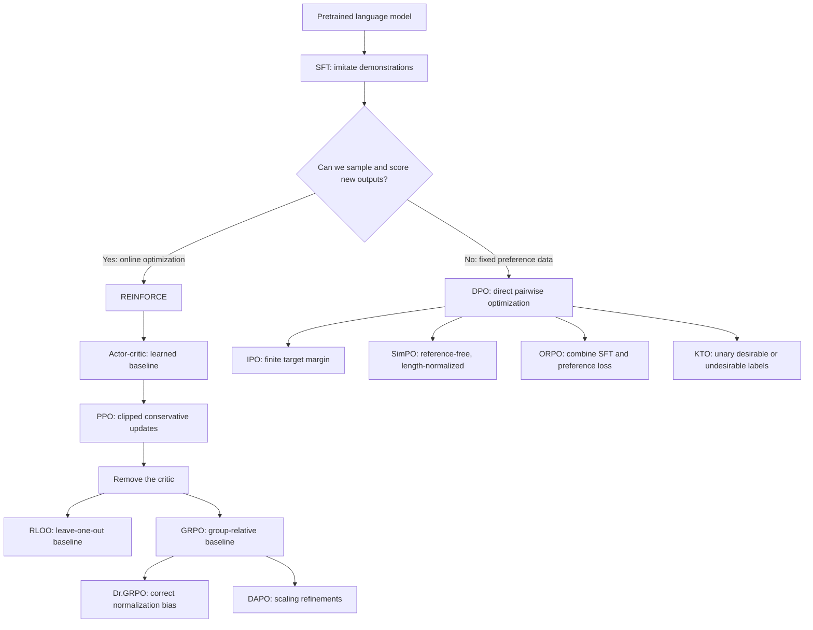

# An introduction to RL and preference alignment in modern LLMs

Hey everyone! In this post, I'll introduce some of the "secret sauce" that allows modern state-of-the-art LLMs to be so useful: preference alignment to human feedback, most commonly through reinforcement learning.

When ChatGPT launched in late 2022, it was the first large language model to break into mainstream public use at enormous scale. To many users, it felt like a sudden technological leap, but underneath the hood, ChatGPT was an extension of an existing line of work rather than an entirely new kind of model. GPT-3 had already demonstrated that a sufficiently large pretrained transformer could write, answer questions, and perform tasks from natural-language prompts. However, one of the key innovations introduced in ChatGPT was RLHF (reinforcement learning with human feedback).

The standard LLM training pipeline begins with **pretraining**. The model learns broad language patterns and knowledge by predicting the next token across a large corpus. It then enters **post-training**, where supervised fine-tuning, or SFT, teaches it to imitate high-quality responses to instructions. RLHF adds another stage to post-training. Humans compare model responses, those comparisons are used to represent desirable behavior, and reinforcement learning updates the model toward responses that receive better feedback. The model is no longer limited to copying one demonstrated answer. It can generate alternatives, receive a reward, and learn which behaviors people prefer.

We'll start here by introducing the basics of reinforcement learning, then iteratively build up toward modern methods. At each stage, we will introduce a method, identify its problems, explain a solution, and then repeat the process as the next limitation appears.

(Note: the post assumes familiarity with the basics of machine learning and deep learning, particularly with how neural networks are trained, including topics such as loss functions, gradient descent, backpropagation. It also assumes familiarity with supervised fine-tuning in LLMs. No prior knowledge of reinforcement learning is required).

## 1. Why is SFT not enough?

Suppose we have prompts $x$ and high-quality responses $y$. SFT minimizes the usual negative log-likelihood:

$$
\mathcal{L}_{\text{SFT}}(\theta)
=
-\mathbb{E}_{(x,y)\sim\mathcal{D}}
\left[
\log \pi_\theta(y\mid x)
\right].
$$

For an autoregressive language model, the response probability factors across tokens:

$$
\log \pi_\theta(y\mid x)
=
\sum_{t=1}^{T}
\log \pi_\theta(y_t\mid x,y_{<t}).
$$

This objective is simple and effective. It teaches the model the format, vocabulary, and behavior represented in the demonstrations. Most post-training pipelines still use SFT because it gives the model a strong starting policy.

### Problem: imitation is not the same as optimization

SFT says, “Make this demonstrated response more likely.” It does not directly say, “Produce any response that solves the problem.”

Consider this prompt:

> Write a function that returns the median of an unsorted list.

A dataset may contain one correct Python implementation. SFT increases the probability of its exact tokens. However, many other implementations are also correct. Some may be faster, clearer, or more robust. SFT does not evaluate these alternatives. It only imitates the response that happened to be recorded.

This creates several limitations.

- Demonstrations are expensive because someone must provide a complete target response.

- A demonstration communicates one answer, even when many answers would be equally good.

- Token-level imitation does not directly represent sequence-level goals such as passing tests, proving a theorem, or satisfying a safety policy.

- SFT cannot improve by discovering a correct response that is better than the demonstrations unless that response appears in the training data.

The important distinction is between **showing** the model what to say and **evaluating** what the model says. For our median function, a test suite could evaluate any proposed implementation. If we can evaluate an output that way, we can let the model generate alternatives and learn which ones work.

That is where reinforcement learning comes in.

## 2. An introduction to reinforcement learning

### Solution: optimize evaluated outcomes

RL describes an agent that interacts with an environment. At time $t$, the agent observes a state $s_t$, chooses an action $a_t$, and eventually receives reward.

For an LLM, the mapping is direct:

| RL concept | Language-model interpretation |
| --- | --- |
| State $s_t$ | The prompt and tokens generated so far |
| Action $a_t$ | The next token |
| Policy $\pi_\theta(a_t\mid s_t)$ | The language model's next-token distribution |
| Trajectory $\tau$ | The complete generated response |
| Reward $R(\tau)$ | A score for the response |

For the median function, the complete program is the trajectory and the test result is the reward. This replaces the requirement to imitate one recorded implementation with an objective that can reward any implementation that passes the tests.

The reward might come from a learned reward model, a human preference, a judge model, unit tests, or a programmatic verifier. A math answer, for example, might receive $1$ when its final answer is correct and $0$ otherwise.

The policy's objective is now expected reward:

$$
J(\theta)
=
\mathbb{E}_{\tau\sim\pi_\theta}
\left[R(\tau)\right].
$$

This objective no longer requires a single target response. The policy can receive credit for any sampled response that earns a high score.

### Problem: rewards are not differentiable through sampling

SFT is optimized with gradient descent. We define a differentiable loss such as negative log-likelihood, compute its gradient with respect to the model parameters, and update those parameters in the direction that reduces the loss:

$$
\theta \leftarrow \theta-\eta\nabla_\theta\mathcal{L}_{\text{SFT}}(\theta).
$$

This works because the SFT loss is built from the model's token probabilities. Those probabilities are differentiable functions of $\theta$, so backpropagation can tell us how each parameter affected the loss.

RL introduces a break in that differentiable path. The model first produces a continuous vector of token probabilities, but sampling turns that vector into one discrete token ID. For a fixed random draw, a small change in the probabilities will usually leave the selected token unchanged. Once a probability crosses the draw's selection boundary, the token changes abruptly. This piecewise-constant operation does not provide a useful derivative from the selected token back to the probabilities that produced it.

The external evaluator creates another break. A compiler, unit test, or human judgment consumes the sampled text and performs operations outside the model's computation graph. These operations may include exact string comparisons, program execution, pass-or-fail branches, or human decisions. Backpropagation has no chain of differentiable operations through which it can connect the returned score to the model parameters.

We can see this by returning to the example of the median function. The model samples four implementations, and a test suite assigns each one a binary reward:

$$
R(y)=
\begin{cases}
1, & \text{if the implementation passes the tests},\\
0, & \text{otherwise}.
\end{cases}
$$

Suppose the observed rewards are $[1,0,1,0]$. Changing one token may change the reward abruptly from $0$ to $1$, or it may leave the reward unchanged. For example, changing an index from `n // 2` to `n // 2 - 1` may cause several tests to fail at once. Most other small changes to the model parameters will not change the sampled code at all. There is therefore no useful local slope telling gradient descent how a slightly different parameter value would improve the binary test result. The test suite tells us which programs passed, but $\nabla_\theta R(y)$ does not provide the gradient needed for an ordinary gradient-descent update.

What we need is a way to change the probability of the sampled code using only its score.

## 3. REINFORCE: increase the probability of rewarding behavior

### Solution: turn a reward into a gradient estimate

Although selecting a discrete token is not differentiable, the policy that produces the sampling probabilities is differentiable. Before sampling, the model computes

$$
\pi_\theta(a\mid s)=P(a_t=a\mid s_t=s),
$$

usually by applying a softmax to its logits. The logits are differentiable functions of the model parameters, and softmax is differentiable as well. We can therefore compute how changing $\theta$ would raise or lower the probability of a particular sampled token, even though we cannot differentiate the act of selecting that token.

The same idea extends to a complete response. Its log-probability is the sum of the differentiable log-probabilities assigned to its sampled tokens. Policy gradients use this differentiable quantity as a bridge between the non-differentiable reward and the model parameters.

The policy-gradient identity gives us such an update. In its simplest sequence-level form,

$$
\nabla_\theta J(\theta)
=
\mathbb{E}_{\tau\sim\pi_\theta}
\left[
R(\tau)\nabla_\theta\log\pi_\theta(\tau)
\right],
$$

where

$$
\log\pi_\theta(\tau)
=
\sum_{t=1}^{T}
\log\pi_\theta(a_t\mid s_t).
$$

This is the core of REINFORCE. If a sampled response gets a positive reward, increase the log-probability of its tokens. If it gets a negative reward, decrease their log-probability.

For those same four median implementations with rewards $[1,0,1,0]$, REINFORCE does not differentiate the test suite. Instead, it differentiates the log-probability that the model assigned to each sampled implementation. The two rewards of $1$ give positive weight to the gradients of the passing programs' log-probabilities. The two rewards of $0$ contribute no positive reinforcement.

The reward remains non-differentiable, but $\log\pi_\theta(y\mid x)$ is differentiable with respect to $\theta$. REINFORCE therefore raises the probability of the passing implementations without ever requiring $\nabla_\theta R(y)$. This is the key trick: use the reward as a scalar weight on a gradient that the language model can compute.

This is our first meaningful improvement over SFT. The model trains on its own outputs, and the loss is tied to an outcome rather than to exact imitation.

### Problem: the gradient is noisy

Imagine that the model now generates four median implementations with rewards $[1,1,0,0]$. The update reinforces every token in each passing program. Some lines were essential. Some were harmless style choices. One line may even have been dubious but never exercised by the tests. A single final reward does not tell us which tokens deserve credit.

There is a second problem. A reward of $1$ has no meaning without context. If the model almost always scores $1$ on easy prompts, this sample is ordinary. If it almost always scores $0$ on a hard prompt, the same reward is exceptional. Raw REINFORCE treats both as equally good.

The result is high variance. Two batches from the same policy can produce very different gradients merely because sampling is random.

### Solution: compare reward with a baseline

The baseline represents the reward the policy should have expected before seeing the sampled action. Instead of asking whether a response received a large reward in absolute terms, the update asks whether it did better or worse than that expectation.

This turns the learning signal from a raw return into a relative one. A reward of $1$ on an easy prompt may produce an update near zero if the policy almost always succeeds. The same reward on a hard prompt may produce a large positive update if success was unlikely. Likewise, a response can receive a positive raw reward but still be discouraged if it performed worse than the relevant expectation.

This comparison reduces variance because the expected part of the reward is common to many sampled actions. Subtracting it removes a component that would otherwise make all of those log-probability gradients move together, even though that component does not help distinguish good actions from bad ones. Across random batches, differences in prompt difficulty and typical reward therefore have less influence on the update. The remaining signal focuses more directly on which samples were unusually good or unusually bad.

Note that the baseline does not fully solve token-level credit assignment. Every token in a completed response may still share one advantage estimate. It does, however, reduce the amount of irrelevant variation in that shared signal. In Section 4, we will see how a state-dependent value function gives different prefixes more specific expectations.

We can subtract any baseline $b(s)$ that does not depend on the sampled action without changing the policy gradient in expectation:

$$
\nabla_\theta J(\theta)
=
\mathbb{E}
\left[
\left(R-b(s)\right)
\nabla_\theta\log\pi_\theta(a\mid s)
\right].
$$

To see why, first consider the **score function** $\nabla_\theta\log\pi_\theta(a\mid s)$. It describes how the parameters would have to change to make action $a$ more or less likely. Its expectation over every action the policy could sample is zero:

$$
\mathbb{E}_{a\sim\pi_\theta(\cdot\mid s)}
\left[
\nabla_\theta\log\pi_\theta(a\mid s)
\right]
=
\sum_a
\pi_\theta(a\mid s)
\nabla_\theta\log\pi_\theta(a\mid s)
=
\sum_a\nabla_\theta\pi_\theta(a\mid s)
=
\nabla_\theta\sum_a\pi_\theta(a\mid s)
=
\nabla_\theta 1
=0.
$$

The intuition is that changing $\theta$ can redistribute probability among actions, but the total probability must remain $1$. If one token becomes more likely, other tokens must collectively become less likely. When averaged over the entire action distribution, those changes cancel.

This is what makes baseline subtraction safe. At a fixed state $s$, an action-independent baseline has the same value regardless of which action is sampled. It can therefore be pulled outside the expectation:

$$
\begin{aligned}
\mathbb{E}_{a\sim\pi_\theta}
\left[
b(s)\nabla_\theta\log\pi_\theta(a\mid s)
\right]
&=
b(s)
\mathbb{E}_{a\sim\pi_\theta}
\left[
\nabla_\theta\log\pi_\theta(a\mid s)
\right]\\
&=b(s)\cdot 0=0.
\end{aligned}
$$

The baseline term has zero expected gradient, so subtracting it does not change the expected policy gradient. It only changes the variance of individual sampled updates.

The first equality above is the exact step that requires the baseline not to depend on the sampled action. The baseline may depend on the state, which includes the prompt and generated prefix, but it must have the same value for every possible next token at that state.

If the baseline were $b(s,a)$, it could not be pulled outside the expectation:

$$
\mathbb{E}_{a\sim\pi_\theta}
\left[
b(s,a)\nabla_\theta\log\pi_\theta(a\mid s)
\right]
=
\sum_a b(s,a)\nabla_\theta\pi_\theta(a\mid s),
$$

which is not generally zero. Such a baseline could assign one value to a token like `return` and another to a token like `raise`. Subtracting it would then selectively alter the probability pressure on those actions rather than merely centering the reward. That would change, or bias, the expected policy gradient.

With an action-independent baseline, subtracting it changes the variance but not the expected gradient direction. The quantity

$$
A(s,a)=Q(s,a)-V(s)
$$

is the **advantage**. It asks whether an action was better or worse than expected in its state.

For those same four median implementations, the average reward is $0.5$. The centered rewards become $[0.5,0.5,-0.5,-0.5]$. Passing implementations are reinforced because they beat the baseline. Failing implementations are discouraged because they underperform it. The baseline cannot tell us which line caused a failure, but it does solve the comparison problem: a reward is now interpreted relative to what the model usually achieves.

### Problem: the correct baseline is unknown

The batch mean is a useful first baseline, but it is only one number computed from whichever samples happened to land in the current batch. This creates three problems.

First, one number cannot account for prompt difficulty. Suppose a batch contains two easy median problems and two hard ones. The policy usually solves the easy problems and usually fails on the hard problems. A reward of $1$ on an easy prompt is ordinary, while a reward of $1$ on a hard prompt is surprising and should receive a larger advantage. Subtracting the same batch mean from both rewards treats them identically.

Second, the batch mean cannot account for progress within a response. Consider two partial implementations of the same median function. One has correctly sorted the list but has not yet handled even-length inputs. The other has already introduced an indexing error. The first prefix has a better chance of eventually passing the tests, so its expected return should be higher. A single batch mean gives both prefixes the same baseline.

Third, the batch mean is itself noisy. A batch containing mostly easy prompts may have a high mean, while the next batch may contain mostly hard prompts and have a low mean. The baseline changes because of random batch composition, even if the underlying policy has barely changed.

What we actually want is not the average reward of the current batch. We want the expected future return for the specific state the policy is in. The next question is how to estimate that state-dependent expectation before the final answer is known.

## 4. Actor-critic: learn what reward to expect

### Solution: learn a state-dependent baseline

The notation $b(s)$ already points toward the solution. Instead of using one scalar batch mean for every state, define the baseline as a function of the current state. The ideal choice is the policy's value function:

$$
V^\pi(s)
=
\mathbb{E}_{\pi}
\left[
G_t\mid s_t=s
\right].
$$

Here, $G_t$ is the total future return from time $t$. The value function is therefore the expected return when the policy starts from state $s$ and continues generating. Because the state contains the prompt and the response prefix, $V^\pi(s)$ can represent both prompt difficulty and how promising the generation looks so far.

The true value function is unknown, so actor-critic methods approximate it with a learned function $V_\phi(s)$. This learned value function is called the **critic**. It observes states from completed rollouts, learns which states tend to lead to high returns, and generalizes that information to new but similar states.

This is better than a batch mean because the critic can produce a different baseline for every prompt and every token position. For the easy and hard median prompts, it can predict different expected rewards. For the two partial implementations, it can assign a higher value to the correctly sorted prefix and a lower value to the prefix with an indexing error. The policy update then measures each sampled action against the expectation that is relevant to its own state.

The term **actor-critic** refers to the two learned functions involved:

- The **actor** is the policy $\pi_\theta$. It chooses actions.

- The **critic** is a value function $V_\phi(s)$. It predicts expected future return from a state.

The actor uses an estimated advantage,

$$
\hat A_t=\hat Q_t-V_\phi(s_t),
$$

and the critic learns by regression toward a return target:

$$
\mathcal{L}_{V}(\phi)
=
\frac{1}{2}
\left(V_\phi(s_t)-\hat V_t^{\text{target}}\right)^2.
$$

For an LLM, the critic can share the policy's transformer backbone and add a scalar value head, or it can be a separate model. In either case, it converts the abstract baseline $b(s)$ into a prediction that can be evaluated for each generated prefix.

### Problem: the true return arrives late

Suppose the model is halfway through writing the median function. It has already sorted the list and started handling even-length inputs, but the tests cannot run until the code is complete. The true return arrives late. Every partial program must share a final outcome that has not happened yet.

If reward is only available after a complete response, the critic cannot immediately observe the true return for every prefix. It must wait for the rollout to finish. Long responses make this even noisier because many token choices share one outcome.

One option is the **Monte Carlo return**. “Monte Carlo” means that we estimate a quantity by sampling complete trajectories and using their observed outcomes. Starting from time $t$, we let the policy finish the response and then add every reward that actually occurred from that point through the end of the rollout:

$$
G_t=\sum_{l=0}^{T-t-1}\gamma^l r_{t+l}.
$$

The discount factor $\gamma\in[0,1]$ determines how much later rewards count. If $\gamma=1$, all future rewards are included at full value. If $\gamma<1$, rewards farther in the future contribute less.

In many LLM tasks, intermediate token rewards are zero and the only task reward arrives after the complete response. For the median-function example, the model generates the entire program, the test suite runs, and the final reward is either $1$ or $0$. The Monte Carlo return for each earlier prefix is then based on that observed final result.

This target does not guess what happens after state $s_t$. It waits, observes the complete rollout, and uses what actually happened. Across many rollouts, it gives an unbiased estimate of the value under the current policy. However, any one rollout may be unusually lucky or unlucky. Two similar prefixes can receive very different returns because their sampled continuations differ, so Monte Carlo value targets can have high variance.

### Solution: bootstrap from the next value estimate

But wait a minute. Write out the full Monte Carlo return again:

$$
G_t
=
r_t+\gamma r_{t+1}+\gamma^2r_{t+2}+\cdots.
$$

The terms after $r_t$ are themselves the return starting from the next time step:

$$
G_{t+1}
=
r_{t+1}+\gamma r_{t+2}+\gamma^2r_{t+3}+\cdots.
$$

Therefore, the first return can be refactored as

$$
G_t=r_t+\gamma G_{t+1}.
$$

The only reason we cannot use this identity immediately is that $G_{t+1}$ is still unknown until the rest of the rollout finishes. However, the critic already exists to estimate exactly this quantity. Its prediction $V_\phi(s_{t+1})$ estimates the expected return from the next state, which is the expected value of $G_{t+1}$.

This suggests replacing the unknown sampled remainder with the value function's estimate:

$$
\hat V_t^{\text{TD}}
=
r_t+\gamma V_\phi(s_{t+1}).
$$

This is the one-step temporal-difference, or TD, target. It uses the reward observed now and bootstraps the rest from a prediction that the critic has already learned.

For the same partial median function, suppose the model adds the even-length branch. The immediate reward is still $0$ because the tests have not run, but the critic may assign the new prefix a much higher value. The target $r_t+\gamma V_\phi(s_{t+1})$ can reflect that improvement immediately instead of waiting for the entire program and its test result.

The corresponding temporal-difference error is

$$
\delta_t
=
r_t+\gamma V_\phi(s_{t+1})-V_\phi(s_t).
$$

This update is available before the full program and its test result are observed. That solves the delayed-feedback problem, but it asks us to trust an imperfect critic.

### Problem: Monte Carlo and one-step TD are opposite extremes

Monte Carlo and one-step TD make opposite tradeoffs.

The Monte Carlo target waits for the complete rollout and uses the return that actually occurred. It does not replace any part of that return with the critic's prediction, so it has low bias as an estimate of the value under the sampled policy. However, it has high variance because the target depends on every random action sampled later in the trajectory. The same promising median-function prefix could receive return $1$ when one sampled continuation completes the program correctly and return $0$ when another continuation introduces a bug.

The one-step TD target uses only the immediate reward and then replaces the entire remaining return with $V_\phi(s_{t+1})$. This lowers variance because it does not depend on all the random actions that would have been sampled after $s_{t+1}$. However, it introduces bias when the critic is inaccurate. If the critic incorrectly assigns the partial median implementation a value of $0.9$, the TD target will be optimistic even if most actual continuations fail the tests.

The two estimators therefore sit at opposite ends of a spectrum:

| Estimate | Observed rewards used | Reliance on critic | Bias | Variance |
| --- | --- | --- | --- | --- |
| Monte Carlo | Complete remaining trajectory | None for the return target | Low | High |
| One-step TD | Immediate reward only | All rewards after the next state | Higher | Lower |

Neither extreme is always best. The preferred tradeoff depends on how noisy the rollouts are and how accurate the critic is.

### Solution: GAE interpolates between the extremes

Generalized Advantage Estimation, or GAE, introduces a tunable parameter $\lambda\in[0,1]$ that controls how far the advantage estimate looks into the sampled future before relying on the critic. It begins with the one-step TD errors

$$
\delta_t=r_t+\gamma V_\phi(s_{t+1})-V_\phi(s_t)
$$

and combines them across future time steps:

$$
\hat A_t^{\text{GAE}(\gamma,\lambda)}
=
\sum_{l=0}^{T-t-1}
(\gamma\lambda)^l\delta_{t+l}.
$$

Written out, the estimate is

$$
\hat A_t^{\text{GAE}}
=
\delta_t
+\gamma\lambda\delta_{t+1}
+(\gamma\lambda)^2\delta_{t+2}
+\cdots.
$$

The parameter $\lambda$ controls how quickly later TD errors lose weight.

#### When $\lambda=0$

Every term after the first is multiplied by zero:

$$
\hat A_t^{\text{GAE}(\gamma,0)}=\delta_t.
$$

GAE becomes the one-step TD advantage. It relies heavily on the critic, which generally gives lower variance but higher bias.

For the partial median implementation, only the immediate reward and the critic's value for the next prefix matter. The eventual test result does not directly enter this advantage estimate.

#### When $\lambda=1$

All future TD errors are included with only the usual discount $\gamma$:

$$
\hat A_t^{\text{GAE}(\gamma,1)}
=
\delta_t+\gamma\delta_{t+1}+\gamma^2\delta_{t+2}+\cdots.
$$

Substituting the definition of each $\delta$ makes the intermediate value terms cancel:

$$
\begin{aligned}
&\left(r_t+\gamma V_\phi(s_{t+1})-V_\phi(s_t)\right)\\
&\quad+\gamma\left(r_{t+1}+\gamma V_\phi(s_{t+2})-V_\phi(s_{t+1})\right)+\cdots\\
&=G_t-V_\phi(s_t),
\end{aligned}
$$

assuming the value after the terminal state is zero. GAE becomes the Monte Carlo advantage. It uses the completed program's observed test result, which gives lower bias but higher variance.

#### When $0<\lambda<1$

An intermediate value blends the two behaviors. For example, with $\lambda=0.5$,

$$
\hat A_t^{\text{GAE}(\gamma,0.5)}
=
\delta_t
+0.5\gamma\delta_{t+1}
+0.25\gamma^2\delta_{t+2}
+0.125\gamma^3\delta_{t+3}
+\cdots.
$$

The estimate uses evidence from later parts of the sampled median implementation, but each additional step matters less. It relies less completely on the critic than one-step TD, while relying less completely on one noisy rollout than Monte Carlo.

Increasing $\lambda$ generally moves toward lower bias and higher variance. Decreasing $\lambda$ generally moves toward higher bias and lower variance. The [GAE paper](https://arxiv.org/abs/1506.02438) develops this estimator and its interpretation in detail.

We now have a lower-variance learning signal. Unfortunately, a better gradient estimate does not guarantee a safe update.

## 5. Why ordinary policy-gradient updates can break the policy

Neural-network training usually takes several gradient steps over each batch. For supervised learning, the dataset does not change when the model changes. Online policy learning is different because the policy creates its own data, so changing the policy also changes the distribution that future examples will come from.

### Problem: reused policy data becomes stale

One way to picture the problem is a ball sitting on a hill. At the ball's current position, the gradient describes the local slope, and the negative gradient points toward the direction the ball should move to go downhill. After the ball moves, however, it is on a different part of the hill. The old direction may no longer point downhill. The slope must be measured again at the new position.

A policy gradient is similarly local. A batch sampled from policy $\pi_{\theta_{\text{old}}}$ estimates which direction would improve that policy. Once an update changes the parameters, the model assigns different probabilities to tokens and generates a different distribution of responses. Reusing the old batch as if nothing changed is like continuing to roll the ball in the old downhill direction without checking the new slope.

Large changes can destroy useful behavior, exploit errors in the reward model, or make the stored batch a poor description of the current policy.

### Solution: importance sampling

Importance sampling is a general statistical technique for estimating an expectation under one distribution using samples drawn from another distribution.

Suppose the quantity of interest is an expectation under a target distribution $p(x)$:

$$
\mathbb{E}_{x\sim p}[f(x)]
=
\sum_x p(x)f(x).
$$

Suppose samples are available from a proposal distribution $q$ instead. Multiplying and dividing each term by $q(x)$ gives

$$
\begin{aligned}
\mathbb{E}_{x\sim p}[f(x)]
&=
\sum_x q(x)\frac{p(x)}{q(x)}f(x)\\
&=
\mathbb{E}_{x\sim q}
\left[
\frac{p(x)}{q(x)}f(x)
\right].
\end{aligned}
$$

The ratio $p(x)/q(x)$ is the **importance weight**. Samples that are more likely under the target distribution than under the proposal receive weights greater than $1$. Samples that are less likely under the target receive weights below $1$. This reweighting lets samples from $q$ estimate an expectation under $p$, provided that $q(x)>0$ wherever $p(x)>0$.

### Applying importance sampling to policy gradients

For policy optimization, the proposal distribution is the old policy $\pi_{\theta_{\text{old}}}$ that generated the batch, while the target distribution is the current policy $\pi_\theta$ being optimized. At a fixed state $s_t$, the general importance weight becomes the probability ratio

$$
r_t(\theta)
=
\frac{
\pi_\theta(a_t\mid s_t)
}{
\pi_{\theta_{\text{old}}}(a_t\mid s_t)
}.
$$

A ratio of $1$ means the sampled token's probability has not changed. A ratio of $1.2$ means it is now 20 percent more likely under the current policy than under the policy that generated the data.

At a fixed state, the general importance-sampling identity becomes

$$
\mathbb{E}_{a_t\sim\pi_\theta}
\left[f(s_t,a_t)\right]
=
\mathbb{E}_{a_t\sim\pi_{\theta_{\text{old}}}}
\left[
r_t(\theta)f(s_t,a_t)
\right].
$$

Choosing the advantage-weighted policy objective for $f$ gives a surrogate objective that can be evaluated with old-policy samples:

$$
\mathcal{L}^{\text{PG}}(\theta)
=
\mathbb{E}_t
\left[r_t(\theta)\hat A_t\right].
$$

For example, if a sampled action had probability $0.10$ under the old policy and probability $0.18$ under the current policy, its importance ratio would be

$$
r(\theta)=\frac{0.18}{0.10}=1.8.
$$

The ratio records that the action is now 1.8 times as likely as it was under the distribution that generated the batch. It adjusts the old sample's contribution to an objective for the current policy.

## 6. PPO: allow improvement, but limit excessive change

### Problem: importance ratios can grow without limit

Importance sampling corrects for the fact that the data came from the old policy, but it does not constrain how far the current policy can move from that old policy. If the current policy makes a sampled action much more likely, the importance ratio becomes large. That large ratio multiplies the action's advantage, so a small number of samples can dominate the update.

For example, suppose an action had probability $0.10$ under the old policy but now has probability $0.60$. Its importance ratio is

$$
r(\theta)=\frac{0.60}{0.10}=6.
$$

If the action has advantage $\hat A=2$, its contribution to the ordinary surrogate objective is

$$
r(\theta)\hat A=6\times2=12.
$$

One old sample now produces an update six times larger than it would have at ratio $1$. A few samples with ratios like this can create large, unstable parameter changes. They can also keep pushing the policy in a direction estimated from the old policy, even after the policy has moved to a region where that direction is no longer reliable.

Importance sampling tells us how much the sampling distribution changed. It does not prevent the change from becoming excessive. PPO is designed to add that missing constraint.

### Solution: clip excessive probability changes

The intuition behind PPO is to allow the policy to learn from an action without allowing that one sample to keep providing a larger benefit as the policy moves farther from the rollout policy. If the ratio remains near $1$, the current and old policies are similar for that action, so the ordinary importance-weighted objective is reasonable. If the ratio moves outside a small interval around $1$, PPO limits the benefit of moving farther in the same direction.

Let that interval be $[1-\epsilon,1+\epsilon]$. Clipping produces

$$
\tilde r_t(\theta)
=
\operatorname{clip}
\left(r_t(\theta),1-\epsilon,1+\epsilon\right).
$$

For a positive advantage, the intuition is straightforward. The sampled action was better than expected, so increasing its probability helps. Once $r_t$ exceeds $1+\epsilon$, PPO stops providing additional benefit for increasing it further.

Negative advantages require more care. A negative advantage means the sampled action was worse than expected, so the desired update decreases its probability. Because the advantage is negative, multiplying by it reverses numerical comparisons.

Suppose $\hat A_t=-2$ and the current policy has made this bad action more likely, giving $r_t=1.5$. The unclipped objective is

$$
r_t\hat A_t=1.5\times(-2)=-3.
$$

If the ratio were blindly clipped to $1.2$, the value would become

$$
\tilde r_t\hat A_t=1.2\times(-2)=-2.4.
$$

Since the objective is maximized, $-2.4$ looks better than $-3$. Naive clipping would hide part of the damage caused by making a bad action too likely. Clipping should limit excessive changes that improve the surrogate objective, but it should not make harmful changes look less harmful.

PPO handles this by comparing the unclipped and clipped terms and taking the smaller, more pessimistic value. For the negative-advantage example above, the minimum is $-3$, so the objective preserves the full penalty. If the policy instead decreases the bad action's probability too far, the clipped term becomes the smaller value and stops rewarding the excessive decrease.

The same rule also handles positive advantages. It caps an excessive probability increase, while preserving the full penalty when the probability of a good action falls too far. This leads to the PPO clipped objective:

$$
\mathcal{L}^{\text{clip}}(\theta)
=
\mathbb{E}_t
\left[
\min\left(
r_t(\theta)\hat A_t,
\operatorname{clip}\left(r_t(\theta),1-\epsilon,1+\epsilon\right)\hat A_t
\right)
\right].
$$

Clipping is not a hard trust-region constraint. Other tokens can change, and the total sequence distribution can still move substantially. Implementations therefore monitor KL divergence and often include a KL penalty.

### Problem: PPO is expensive and complicated

Imagine that each model is large enough to fill most of one accelerator. An LLM PPO system may need four model roles during training:

- The policy generates and learns.

- The old policy provides rollout probabilities.

- The reference policy measures drift.

- The critic estimates values.

A learned reward model may add another large network. A training job that began with one policy can now involve four or five model-sized components. Some weights can be shared or offloaded, but the memory and systems burden remains substantial. The critic also creates a learning problem inside the learning problem. If its estimates are poor, the policy receives poor advantages.

Can we keep online reward optimization while removing the critic?

## 7. RLOO: use other samples as the baseline

### Solution: replace the critic with peer responses

The critic exists to answer a comparative question: was this response better than expected for this prompt? We can answer that without another model if we generate several responses to the same prompt and compare them with one another.

In the same setup where every model-sized component nearly fills an accelerator, RLOO removes the learned critic. The policy, old-policy probabilities, and reference calculations may still be needed, but one entire model role and its optimization state disappear. The price is that the policy must generate several responses for each prompt.

Suppose we sample $K$ responses $y_1,\ldots,y_K$ for prompt $x$, with rewards $R_1,\ldots,R_K$. REINFORCE Leave-One-Out, or RLOO, gives response $i$ the advantage

$$
\hat A_i^{\text{RLOO}}
=
R_i-
\frac{1}{K-1}
\sum_{j\ne i}R_j.
$$

Each response is compared with the mean reward of the other responses. Leaving the current sample out avoids using its reward inside its own baseline.

Suppose those four responses are implementations of our median function, with rewards $[1,1,0,0]$. The first response gets advantage $1-\frac{1}{3}=\frac{2}{3}$. The third gets $0-\frac{2}{3}=-\frac{2}{3}$. RLOO answers the same question as the critic by using the other implementations as the baseline. We have removed a model-sized component from the PPO setup.

RLOO is still an online policy-gradient method. It samples from the current policy and optimizes observed rewards. It simply replaces the critic with a Monte Carlo baseline. The [RLOO study](https://arxiv.org/abs/2402.14740) found that carefully adapted REINFORCE-style methods could be competitive for RLHF while reducing PPO's complexity.

### Problem: raw comparisons can have inconsistent scale

Suppose one prompt produces median implementations with binary rewards $[1,1,0,0]$, while another produces code-quality scores $[90,80,20,10]$. Both groups contain two strong and two weak answers, but the second produces gradients roughly 70 times larger. Raw leave-one-out differences let reward scale, rather than just relative quality, determine which prompt dominates the update.

RLOO also still needs multiple responses per prompt. If one implementation takes two seconds to sample, a group of eight takes up to sixteen seconds of serial generation, or enough parallel memory to generate them together. Generation is often the dominant cost in LLM RL. The next method does not eliminate this tradeoff.

## 8. GRPO: evaluate a response relative to its group

### Solution: normalize advantages within each group

Group Relative Policy Optimization, or GRPO, keeps the same group of samples and follows the same broad intuition. For one prompt, sample $G$ responses and normalize each reward using group statistics:

$$
\hat A_i^{\text{GRPO}}
=
\frac{R_i-\bar R}{s_R},
\qquad
\bar R=\frac{1}{G}\sum_{j=1}^{G}R_j.
$$

Here $s_R$ is the group's reward standard deviation, usually with a small numerical stabilizer in an implementation. These advantages can be inserted into a PPO-like clipped objective at each response token:

$$
\mathcal{L}_{\text{GRPO}}
=
\mathbb{E}
\left[
\frac{1}{G}
\sum_{i=1}^{G}
\frac{1}{|y_i|}
\sum_{t=1}^{|y_i|}
\min\left(
r_{i,t}\hat A_i,
\operatorname{clip}(r_{i,t},1-\epsilon,1+\epsilon)\hat A_i
\right)
\right].
$$

GRPO therefore combines a critic-free group baseline with conservative policy updates.

For the same two reward groups, subtracting each group mean and dividing by its standard deviation puts the binary rewards $[1,1,0,0]$ and the 100-point scores $[90,80,20,10]$ on a comparable scale. The relative winners can contribute similarly even though the original reward units differ.

[DeepSeekMath](https://arxiv.org/abs/2402.03300) introduced GRPO to reduce the training resources required by PPO, and later reasoning systems made this family widely known.

Consider eight solutions to the same math problem. If three are correct, the correct solutions receive positive relative advantages and the incorrect ones receive negative advantages. The comparison is prompt-specific. A correct answer to a hard prompt can be treated differently from an identical binary reward in a group where almost every answer is correct.

### Problem: normalization and aggregation change the learning signal

The simple formula hides several edge cases.

Imagine two groups of eight math solutions. The first group has four correct answers, while the second has eight correct answers. The second group cost just as much to generate, but every centered advantage is zero. It teaches us nothing. Also suppose that the first group's correct and incorrect rewards differ only slightly. Dividing by its tiny standard deviation can magnify a small distinction into a large update.

- If every response receives the same reward, the group contains no comparative signal.

- Dividing by group standard deviation can give groups with low reward variance disproportionate weight.

- Averaging tokens within each response can change how short and long responses contribute to the batch gradient.

- Clipping can create different behavior for positive and negative advantages, including “dead” gradients once probability ratios cross a clipping boundary.

These are not merely cosmetic implementation details. They determine which prompts and tokens dominate learning.

### Solution: Dr.GRPO and DAPO repair specific pathologies

[Dr.GRPO](https://arxiv.org/abs/2503.20783) removes normalization choices that can bias training toward response length or particular reward variances. For the first math group, this prevents the tiny reward standard deviation from arbitrarily magnifying the update. Its central lesson is that the denominator in a loss is part of the algorithm. Normalizing each response by its own length is not equivalent to normalizing over all valid tokens in a batch.

[DAPO](https://arxiv.org/abs/2503.14476) treats large-scale reasoning RL as both an algorithm and a systems problem. For the second, all-correct math group, dynamic sampling replaces the uninformative prompt instead of spending an update on eight zero advantages. DAPO also introduces asymmetric clipping bounds, computes a token-level policy loss, and handles overlong responses explicitly. These changes address practical failures observed when scaling GRPO-like training.

The evolution is familiar by now. REINFORCE directly optimizes reward but is noisy. Actor-critic reduces variance but adds a critic. PPO stabilizes repeated updates but adds more machinery. RLOO and GRPO remove the critic, then Dr.GRPO and DAPO refine the details that matter at scale.

All of these methods remain **online**. They repeatedly sample from a changing policy and evaluate new outputs.

### Problem: online RL is expensive and indirect for fixed preferences

Online RL is useful when exploration matters, but it is expensive. It requires fresh rollouts, reward evaluation, and policy-gradient optimization. PPO adds a critic, while critic-free methods replace that cost with several responses per prompt. Training may still involve a policy, an old policy, a reference policy, and a reward model or verifier.

The process is also indirect when the available feedback is already a fixed dataset of preference pairs:

$$
(x,y_w,y_l),
$$

where $y_w$ was preferred over $y_l$ for prompt $x$. A conventional RLHF pipeline first converts these comparisons into a scalar reward model. It then samples new responses and runs online RL against that model. This solves a more general problem than directly fitting the recorded preferences.

The reward model can also become an imperfect optimization target. The policy may discover outputs outside the reward model's training distribution that receive high scores for the wrong reason.

Suppose annotators prefer this answer:

> Paris is the capital of France.

over a repetitive paragraph that says the same thing five times. A reward model might learn the crude rule that shorter answers are better. Online optimization could then discover “Paris,” followed eventually by answers so short that they omit necessary explanations. KL regularization limits the damage, but it does not make the reward model understand when detail is useful.

The pair only said that the concise answer was better than the repetitive one. RLHF turns that local comparison into a general scoring function and then gives the policy freedom to optimize it. Can we fit the policy directly to the recorded preferences instead?

## 9. DPO: the policy is an implicit reward model

### Solution: train the policy directly on each preference pair

What if we could remove the RL machinery entirely and achieve the same preference-learning goal with the same optimization machinery used for SFT? We would train with gradient descent on a fixed dataset of preferred and rejected responses. There would be no online rollouts, policy-gradient estimator, critic, or separately optimized reward model.

To see how this is possible, revisit the reward function that RLHF is trying to optimize. Preference data does not provide scalar rewards directly. It provides comparisons. A common setup assumes that an unknown reward function $r^*(x,y)$ explains those comparisons through the Bradley-Terry model:

$$
P(y_w\succ y_l\mid x)
=
\sigma\left(
r^*(x,y_w)-r^*(x,y_l)
\right).
$$

Conventional RLHF fits a model of $r^*$ and then finds a policy with high expected reward while penalizing divergence from a reference policy:

$$
\max_\pi
\mathbb{E}_{y\sim\pi(\cdot\mid x)}
\left[r^*(x,y)\right]
-
\beta D_{\mathrm{KL}}
\left(
\pi(\cdot\mid x)\,\|\,\pi_{\mathrm{ref}}(\cdot\mid x)
\right).
$$

For this KL-regularized objective, the optimal policy has a closed-form relationship with the reward:

$$
\pi^*(y\mid x)
\propto
\pi_{\text{ref}}(y\mid x)
\exp\left(\frac{1}{\beta}r^*(x,y)\right).
$$

Rearranging expresses the reward in terms of the optimal policy, up to a prompt-dependent constant:

$$
r^*(x,y)
=
\beta
\log
\frac{\pi^*(y\mid x)}{\pi_{\text{ref}}(y\mid x)}
+C(x).
$$

The constant $C(x)$ is the same for every response to prompt $x$, so it cancels in the difference $r^*(x,y_w)-r^*(x,y_l)$.

But wait. This means that the reward difference inside the Bradley-Terry preference model can be rewritten entirely as a function of a policy. Replace the unknown optimal policy $\pi^*$ with the trainable policy $\pi_\theta$, then define the reference-relative log-probability gap:

$$
h_\theta(x,y_w,y_l)
=
\log\frac{\pi_\theta(y_w\mid x)}{\pi_{\text{ref}}(y_w\mid x)}
-
\log\frac{\pi_\theta(y_l\mid x)}{\pi_{\text{ref}}(y_l\mid x)}.
$$

Substituting this expression into the preference likelihood gives the DPO loss:

$$
\mathcal{L}_{\text{DPO}}(\theta)
=
-\mathbb{E}_{(x,y_w,y_l)\sim\mathcal D}
\left[
\log\sigma\left(\beta h_\theta(x,y_w,y_l)\right)
\right].
$$

The full derivation is in the [DPO paper](https://arxiv.org/abs/2305.18290). The important result is that the same preference model and KL-regularized reward objective produce a loss that can be optimized directly over $\theta$. The loss increases the preferred response's reference-relative log-probability and decreases the rejected response's reference-relative log-probability.

Return to the Paris preference pair. Let $y_w$ be the concise answer and $y_l$ be the repetitive paragraph. Suppose the reference policy assigns them probabilities $0.10$ and $0.05$, while the trainable policy assigns them probabilities $0.15$ and $0.06$. The reference-relative gap is

$$
\begin{aligned}
h_\theta(x,y_w,y_l)
&=
\log\frac{0.15}{0.10}
-
\log\frac{0.06}{0.05}\\
&=
\log(1.5)-\log(1.2)\\
&=
\log(1.25)>0.
\end{aligned}
$$

Both responses became more likely than they were under the reference policy, but the preferred response increased by more in relative terms. DPO rewards that positive gap. It learns directly from the recorded pair without sampling a new response or asking a separate reward model to score one.

DPO has several practical attractions.

- It uses an ordinary supervised-style training loop over fixed triples.

- It does not require online generation during each optimizer step.

- It does not train a separate scalar reward model or critic.

- Its reference-relative reward retains the KL-regularized RL interpretation.

### DPO fixes one pipeline, not every problem

DPO is simpler than PPO-based RLHF, but it is not assumption-free. Our Paris pair makes the limitations easy to see. It tells the model which of those two answers won, but it says nothing about a third answer that is concise and factually wrong. It also does not tell us how strong the preference should become after the model already favors the winner.

It treats pairwise preferences through a particular probabilistic model. It learns from a fixed data distribution, so it cannot automatically explore outputs that the dataset does not contain. It requires a reference policy during training. Its sequence log-probabilities also scale with response length, which can entangle preference learning with length.

These limitations do not point to one obvious replacement. They give us several separate questions. Should a learned preference gap grow forever? Do we need a reference model? Must SFT and preference learning happen in separate stages? Do we need paired responses at all?

Each DPO variant below answers one of those questions.

## 10. The DPO family: four different directions

There is no single “next DPO.” Its limitations point in different directions. IPO changes the statistical objective. SimPO removes the reference model and normalizes for length. ORPO folds preference learning into SFT. KTO changes the feedback format itself.

Each variant addresses one question.

### IPO: stop pushing an already-large preference gap

#### Problem

The standard RLHF story makes two approximations. It represents pairwise preferences using differences between scalar rewards, then assumes the learned reward generalizes to outputs produced by a changing policy. DPO removes the second approximation because it does not fit a separate reward model. It still relies on the first preference model.

This can make the logistic objective increasingly confident on separable data. Consider the Paris example again. Suppose every annotator prefers “Paris is the capital of France” over the repetitive paragraph, and the policy already favors the concise answer by a huge margin. Continuing to enlarge that gap still lowers the DPO loss. The pair keeps pushing even though the model has clearly learned its lesson.

#### Solution

Identity Preference Optimization, or IPO, starts from a framework that optimizes preferences as preferences rather than first interpreting them as pointwise rewards. Its practical loss places the policy's preference margin near a finite target:

$$
\mathcal{L}_{\text{IPO}}(\theta)
=
\mathbb{E}_{(x,y_w,y_l)\sim\mathcal D}
\left[
\left(
h_\theta(x,y_w,y_l)-\frac{1}{2\beta}
\right)^2
\right].
$$

Here $h_\theta$ is the same reference-relative log-ratio difference defined above. Instead of asking for an unbounded separation, IPO regresses toward a controlled margin. The regularization parameter determines the target.

For that same Paris pair, suppose IPO's target margin is $2$. Once the concise answer leads the repetitive one by $2$, the pair produces no pressure to separate them further. IPO directly fixes the problem in the example: the model can learn a clear preference without spending the rest of training making it more extreme. DPO's logistic loss would still have a nonzero gradient.

IPO is one instance of the broader $\Psi$PO framework introduced in [A General Theoretical Paradigm to Understand Learning from Human Preferences](https://arxiv.org/abs/2310.12036). The paper contains the theoretical development and performance guarantees.

### SimPO: remove the reference model and control length

#### Problem

DPO needs both the trainable policy and a frozen reference policy. It also uses total sequence log-probability. Because log-probabilities add over tokens, longer responses naturally accumulate more negative values. This can introduce an unwanted relationship between length and implicit reward.

Imagine two correct explanations of why Paris is the capital of France. One gives the necessary context in 40 tokens. The other gives equally useful context in 200 tokens. Even if the model is equally confident about each token, the longer answer accumulates far more negative log-probability. A raw sequence score makes length part of the comparison whether we intended it or not.

#### Solution

Simple Preference Optimization, or SimPO, defines an implicit reward using average log-probability:

$$
r_{\text{SimPO}}(x,y)
=
\frac{\beta}{|y|}
\log\pi_\theta(y\mid x).
$$

It removes the reference model and introduces a target margin $\gamma$ between preferred and rejected responses:

$$
\mathcal{L}_{\text{SimPO}}(\theta)
=
-\mathbb{E}
\left[
\log\sigma\left(
\frac{\beta}{|y_w|}\log\pi_\theta(y_w\mid x)
-
\frac{\beta}{|y_l|}\log\pi_\theta(y_l\mid x)
-\gamma
\right)
\right].
$$

The intuition is direct. Give the preferred response a higher average log-probability than the rejected response by at least a chosen margin.

For the same 40-token and 200-token Paris explanations, dividing by $|y|$ compares average token confidence instead of allowing the extra 160 tokens to dominate automatically. The margin prevents a tiny preference gap from being considered sufficient.

The [SimPO paper](https://arxiv.org/abs/2405.14734) reports lower memory use from eliminating the reference model and strong empirical results in its evaluated settings.

### ORPO: combine imitation and preference learning

#### Problem

A common alignment pipeline first runs SFT and then runs a separate preference-optimization stage. This requires two training phases and two objectives applied at different times.

Suppose a base model assigns low probability to both a helpful support answer and a dismissive one. A preference-only stage can learn that the helpful answer should rank higher, but ordinary instruction tuning is also needed to make helpful support answers likely in the first place. Running SFT and preference optimization separately solves those two pieces in two different stages.

There is a natural question: why not do both in one loss?

#### Solution

Odds Ratio Preference Optimization, or ORPO, starts from the same high-level goal as DPO: the preferred response should become more likely relative to the rejected response. However, ORPO wants to achieve this separation while also performing SFT on the preferred response in a single training stage.

To understand the idea, first recall what **odds** mean. If an event has probability $p$, its odds are

$$
\operatorname{odds}(p)=\frac{p}{1-p}.
$$

Odds compare the probability that the event happens with the probability that it does not happen. If $p=0.2$, the odds are $0.2/0.8=0.25$, or one to four. If $p=0.8$, the odds are $0.8/0.2=4$, or four to one. Because odds increase whenever probability increases, a response with larger odds is also a more likely response.

Now compare the odds of the preferred response with the odds of the rejected response. If

$$
\frac{\operatorname{odds}(y_w)}{\operatorname{odds}(y_l)}>1,
$$

the model favors the preferred response. Making this ratio larger requires raising the preferred response's odds, lowering the rejected response's odds, or both. Optimizing the odds ratio therefore creates the same kind of pairwise separation as DPO: $y_w$ should outrank $y_l$.

The important difference is how the two methods define that separation. DPO compares the responses through their log-probability changes relative to a frozen reference policy. ORPO compares their odds under the current policy and uses an SFT term to keep directly raising the preferred response's likelihood. They do not have identical losses, but they enforce the same desired ordering without requiring ORPO to load a reference model.

We can now write the formal objective. Let

$$
p_\theta(y\mid x)=\exp\left(
\frac{1}{|y|}\log\pi_\theta(y\mid x)
\right)
$$

denote a length-normalized sequence likelihood. Its odds are

$$
\operatorname{odds}_\theta(y\mid x)
=
\frac{p_\theta(y\mid x)}{1-p_\theta(y\mid x)}.
$$

ORPO uses the log odds ratio in a pairwise classification loss:

$$
\mathcal{L}_{\text{OR}}(\theta)
=
-\mathbb{E}
\left[
\log\sigma\left(
\log
\frac{
\operatorname{odds}_\theta(y_w\mid x)
}{
\operatorname{odds}_\theta(y_l\mid x)
}
\right)
\right].
$$

The sigmoid maps the log odds ratio to a predicted probability that $y_w$ should win. The negative log-likelihood is small when the preferred response has much larger odds than the rejected response.

For low-probability sequences, $1-p\approx1$, so $\operatorname{odds}(p)\approx p$. In that regime, the log odds ratio behaves approximately like

$$
\log p_\theta(y_w\mid x)-\log p_\theta(y_l\mid x),
$$

which makes the connection to DPO's log-probability separation especially clear.

ORPO then combines this preference term with chosen-response SFT:

$$
\mathcal{L}_{\text{ORPO}}
=
\mathcal{L}_{\text{SFT}}(x,y_w)
+
\lambda\mathcal{L}_{\text{OR}}.
$$

The SFT term teaches the model to produce the preferred response. The odds-ratio term explicitly separates its style from the rejected response. No frozen reference model is required.

For those same two low-probability support answers, merely decreasing the dismissive response does not teach the model what to say. ORPO's SFT term raises the helpful answer's probability, while its odds-ratio term separates that answer from the dismissive alternative. One objective now handles both parts of the example.

The [ORPO paper](https://arxiv.org/abs/2403.07691) presents this as a monolithic preference-alignment stage.

### KTO: learn from good and bad examples without pairs

#### Problem

Pairwise data is often expensive. For every prompt, someone must inspect two responses and choose between them. Existing product data may instead contain independent signals: a thumbs-up, a thumbs-down, a successful task, or an abandoned interaction.

DPO cannot directly consume one desirable response in isolation because its loss depends on the difference between a chosen and rejected response for the same prompt.

Imagine a support system with 10,000 independently liked answers and 2,000 disliked answers. The logs do not contain matched pairs. Constructing pairs after the fact could compare answers to different questions, and discarding unmatched examples would waste most of the data.

#### Solution

Kahneman-Tversky Optimization, or KTO, replaces the missing paired response with a reference point. Instead of asking whether response $y_w$ is better than response $y_l$, it asks whether one response is better or worse than what the current policy typically produces.

To make that comparison, KTO assigns each response an **implicit reward**. This reward measures how much more likely the response is under the current policy than under the frozen reference policy. A large positive implicit reward means the current policy has increased the response's probability substantially. A negative implicit reward means it has made the response less likely.

However, zero is not always the right dividing line between a gain and a loss. As training proceeds, the current policy generally moves away from the reference policy, so its typical implicit reward changes. KTO therefore uses a moving reference point $z_0$: the average implicit reward of responses sampled from the current policy. In other words, $z_0$ measures the policy's typical amount of drift from the reference.

KTO then uses each unary label as follows:

- A desirable response should have an implicit reward above $z_0$. The policy should favor it more than it favors a typical response.

- An undesirable response should have an implicit reward below $z_0$. The policy should favor it less than it favors a typical response.

This construction turns an isolated thumbs-up or thumbs-down into a relative comparison without inventing a paired response. The comparison is between the labeled response and the current policy's reference level.

We can now write the formal objective. KTO defines the reference-relative implicit reward as

$$
r_\theta(x,y)
=
\beta
\log\frac{\pi_\theta(y\mid x)}{\pi_{\text{ref}}(y\mid x)}.
$$

It then defines a reference level based on the policy's average KL divergence from the reference policy:

$$
z_0
=
\mathbb{E}_{x}
\left[
\beta D_{\mathrm{KL}}
\left(
\pi_\theta(\cdot\mid x)
\,\|\,
\pi_{\text{ref}}(\cdot\mid x)
\right)
\right].
$$

The formula for $z_0$ follows directly from the implicit reward. For a fixed prompt, take the expected implicit reward over responses sampled from the current policy:

$$
\begin{aligned}
\mathbb{E}_{y\sim\pi_\theta(\cdot\mid x)}
\left[r_\theta(x,y)\right]
&=
\beta
\mathbb{E}_{y\sim\pi_\theta(\cdot\mid x)}
\left[
\log\frac{\pi_\theta(y\mid x)}{\pi_{\text{ref}}(y\mid x)}
\right]\\
&=
\beta D_{\mathrm{KL}}
\left(
\pi_\theta(\cdot\mid x)
\,\|\,
\pi_{\text{ref}}(\cdot\mid x)
\right).
\end{aligned}
$$

Averaging this quantity over prompts gives $z_0$. At initialization, if $\pi_\theta=\pi_{\text{ref}}$, every log ratio is zero and $z_0=0$. As the policy moves away from the reference, its average KL divergence generally increases, so the reference point moves as well.

Computing the exact expectation would require summing over every possible response. In practice, $z_0$ is estimated from a minibatch using a Monte Carlo estimate of the policy-reference log ratio. The estimate is used as a reference point rather than as a separate reward model.

For a desirable example, KTO rewards $r_\theta(x,y)$ being above $z_0$. For an undesirable example, it rewards the implicit reward being below $z_0$. A simplified per-example utility is

$$
v(x,y)=
\begin{cases}
\lambda_D\,\sigma(r_\theta(x,y)-z_0),
& y\text{ is desirable},\\[4pt]
\lambda_U\,\sigma(z_0-r_\theta(x,y)),
& y\text{ is undesirable}.
\end{cases}
$$

Training minimizes a weighted complement of this utility. The weights $\lambda_D$ and $\lambda_U$ allow the method to handle class imbalance and different costs for desirable and undesirable behavior.

KTO can use all 12,000 labels from that same support system directly. A liked answer is pushed above the KL-based reference point, while a disliked answer is pushed below it. There is no need to invent a rejected response for each liked answer or throw unmatched records away.

KTO draws its shape from prospect theory, where outcomes are perceived relative to a reference point and gains and losses can have different weights. The [KTO paper](https://arxiv.org/abs/2402.01306) gives the complete objective and derivation.

The broader lesson is important: no preference loss is universally best. Each objective encodes assumptions about the feedback, the desired margin, sequence length, and acceptable policy drift.

## 11. The modern post-training landscape

We can now organize the methods by the problem they solve rather than by their acronyms.

The left branch is best understood as **online RL**. The policy generates new responses during training. An evaluator scores them, and the policy learns from the results. This supports exploration. If the model discovers a novel correct proof, program, or strategy, the training loop can reinforce it even when it never appeared in a demonstration dataset.

The price is sampling cost and optimization complexity. Online RL is also only as trustworthy as its reward. A verifiable math answer gives a clean outcome signal, but even then a correct final answer may hide invalid reasoning. A learned preference reward is broader but easier to exploit.

The right branch is **offline preference optimization**. Training uses a fixed dataset of judgments. These methods are simpler to run and cannot exploit a live reward model through unrestricted exploration. However, they are limited by the coverage of their data. They cannot directly learn from better outputs that the current policy discovers unless those outputs are added to a new preference dataset.

### A compact comparison

| Method | Feedback | Online sampling | Learned critic | Reference policy | Main idea |
| --- | --- | ---: | ---: | ---: | --- |
| SFT | Demonstration | No | No | No | Imitate a target response |
| REINFORCE | Scalar reward | Yes | No | Optional | Weight log-probability by return |
| Actor-critic | Scalar reward | Yes | Yes | Optional | Learn a state-dependent baseline |
| PPO | Scalar reward | Yes | Usually | Usually | Clip probability-ratio updates |
| RLOO | Several rewards per prompt | Yes | No | Usually | Use other samples as the baseline |
| GRPO family | Group rewards per prompt | Yes | No | Usually | Normalize or compare within a group |
| DPO | Preferred and rejected pair | No | No | Yes | Fit a reference-relative preference margin |
| IPO | Preferred and rejected pair | No | No | Yes | Regress toward a finite margin |
| SimPO | Preferred and rejected pair | No | No | No | Compare length-normalized policy scores |
| ORPO | Preferred and rejected pair | No | No | No | Combine SFT with odds-ratio separation |
| KTO | Desirable or undesirable label | No | No | Yes | Compare unary feedback with a KL reference point |

### How should we choose?

Use SFT when demonstrations directly specify the behavior and simplicity matters. It remains the normal foundation even when later stages use RL or preference optimization.

Use offline preference optimization when you have a stable dataset of human or synthetic comparisons and want a conventional training loop. DPO is a strong conceptual baseline. IPO changes its preference assumptions. SimPO removes the reference and normalizes for length. ORPO combines instruction tuning and preference alignment. KTO is useful when feedback is unary rather than paired.

Use online RL when the model can discover outputs that are better than the fixed dataset and you can evaluate them. PPO remains an important general template, while RLOO and GRPO-style methods remove the critic and fit naturally with multiple verifiable rollouts. Dr.GRPO and DAPO show that large-scale performance depends on subtle implementation details such as normalization, sampling, clipping, and token aggregation as much as on the headline objective.

These categories can also be combined. A team might use SFT to establish instruction following, DPO to absorb broad preference data, and online RL with verifiable rewards to improve mathematical reasoning. The stages answer different questions.

### Considerations for state-of-the-art post-training

- **The training signal should determine the objective.** SFT is appropriate when demonstrations specify the desired behavior. Outcome-based RL is useful when many possible responses can receive a reliable score. Pairwise methods fit comparison data, while KTO fits independent desirable or undesirable labels.

- **Online and offline methods solve different problems.** Online RL can explore and reinforce useful outputs that do not appear in a fixed dataset, but it requires expensive sampling and a trustworthy evaluator. Offline preference optimization is simpler, but it is limited by the coverage and biases of its data.

- **The reward is part of the algorithm.** No optimizer can compensate for a reward that measures the wrong behavior. Public tests can encourage special-casing, final-answer rewards can reinforce invalid reasoning, and preference judges can encode biases such as a preference for longer responses. Several practices can reduce these risks:

  - Use verifiers that measure the intended property rather than an easy-to-exploit correlate.

  - Hold out adversarial evaluations that the policy cannot optimize directly.

  - Monitor response length, diversity, KL divergence, and reward together, because reward alone can hide collapse.

  - Refresh learned judges when the policy moves beyond their training distribution.

  - Inspect sampled trajectories, because aggregate scores do not reveal every reward exploit.

- **Every method needs some notion of comparison or reference.** REINFORCE benefits from a baseline. Actor-critic learns a state-dependent value. RLOO and GRPO compare peer samples. PPO compares the current policy with the rollout policy and often an SFT reference. DPO and KTO use a frozen reference policy, while SimPO replaces it with length normalization and a target margin.

- **Implementation details can change the effective algorithm.** PPO clipping, KL penalties, reward normalization, dynamic sampling, token aggregation, response-length handling, and dataset construction all affect training. Two systems using the same headline objective can behave differently because of these choices.

- **Post-training stages can be combined.** A system might use SFT to establish instruction following, offline preferences to shape general behavior, and online RL with verifiable rewards to improve reasoning. These stages use different feedback and need not compete for a single place in the pipeline.

- **There is no single correct approach.** The history of post-training is better understood as a progression of tradeoffs than as a sequence in which every new method replaces the previous one:

$$
\text{imitation}
\quad\longrightarrow\quad
\text{outcome optimization}
\quad\longrightarrow\quad
\text{variance reduction}
\quad\longrightarrow\quad
\text{conservative updates}
\quad\longrightarrow\quad
\text{simpler estimators and objectives}.
$$

## References

- John Schulman et al. [High-Dimensional Continuous Control Using Generalized Advantage Estimation](https://arxiv.org/abs/1506.02438), 2015.

- John Schulman et al. [Proximal Policy Optimization Algorithms](https://arxiv.org/abs/1707.06347), 2017.

- Long Ouyang et al. [Training Language Models to Follow Instructions with Human Feedback](https://arxiv.org/abs/2203.02155), 2022.

- Rafael Rafailov et al. [Direct Preference Optimization: Your Language Model Is Secretly a Reward Model](https://arxiv.org/abs/2305.18290), 2023.

- Mohammad Gheshlaghi Azar et al. [A General Theoretical Paradigm to Understand Learning from Human Preferences](https://arxiv.org/abs/2310.12036), 2023.

- Zhihong Shao et al. [DeepSeekMath: Pushing the Limits of Mathematical Reasoning in Open Language Models](https://arxiv.org/abs/2402.03300), 2024.

- Kawin Ethayarajh et al. [KTO: Model Alignment as Prospect Theoretic Optimization](https://arxiv.org/abs/2402.01306), 2024.

- Arash Ahmadian et al. [Back to Basics: Revisiting REINFORCE Style Optimization for Learning from Human Feedback in LLMs](https://arxiv.org/abs/2402.14740), 2024.

- Jiwoo Hong et al. [ORPO: Monolithic Preference Optimization without Reference Model](https://arxiv.org/abs/2403.07691), 2024.

- Yu Meng et al. [SimPO: Simple Preference Optimization with a Reference-Free Reward](https://arxiv.org/abs/2405.14734), 2024.

- Qiying Yu et al. [DAPO: An Open-Source LLM Reinforcement Learning System at Scale](https://arxiv.org/abs/2503.14476), 2025.

- Zichen Liu et al. [Understanding R1-Zero-Like Training: A Critical Perspective](https://arxiv.org/abs/2503.20783), 2025.
