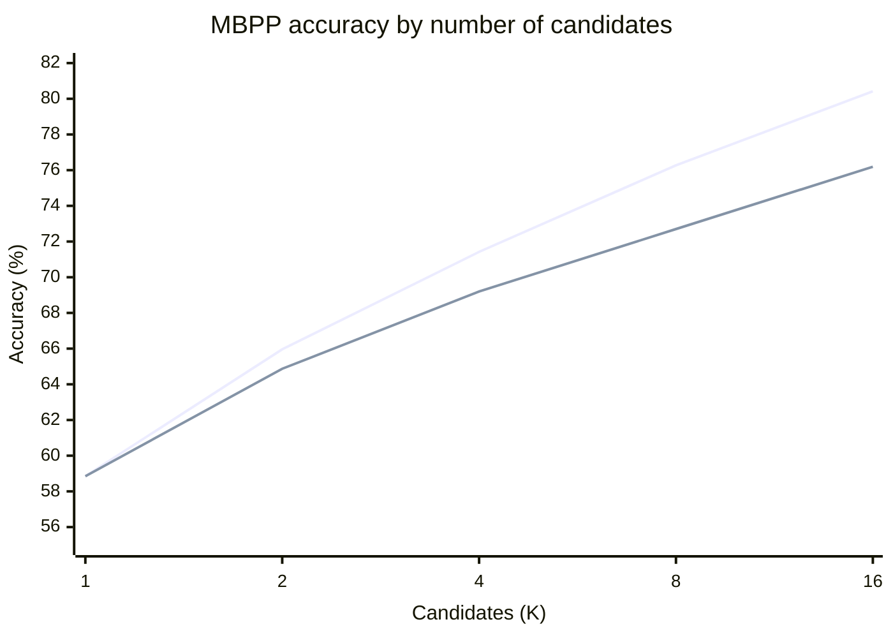
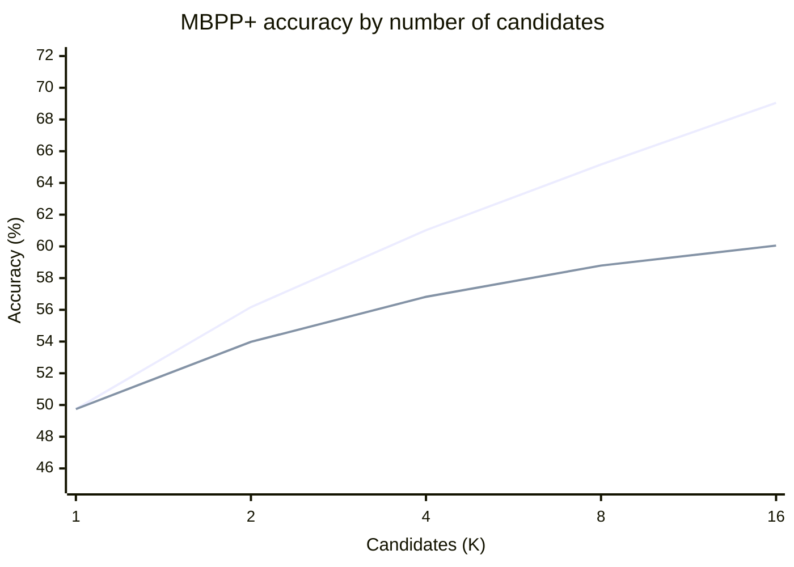

### Summary

I was able to take a very small LLM with under a billion parameters (`Qwen2.5-Coder-0.5B-Instruct`) and boost performance on MBPP through two approaches:

1. Post-training the model through GRPO.
2. Sampling multiple generations from the model and using a cheap verifier to filter them. The verifier required executing code in a sandbox and clustering similar outputs.

The first technique improved pass@1 by **12.2%** while the second improved by up to **21.6%**, albeit at the cost of higher latency.

### Introduction

Modern LLMs are very powerful, but many performance gains have come from scaling laws. In practice, this often means using more data, compute, and larger models. In some settings, we cannot use that much compute. A model that runs locally may have to fit in very little disk space, RAM, or CUDA memory, especially on a small device.

I wanted to find how much performance I could squeeze out of one of the smallest coding models available, a 0.5B-parameter `Qwen2.5-Coder-0.5B-Instruct`. The next two sections describe the approaches I tried before presenting the full results. Each section starts with the approach that worked, then explains the alternatives that did not work and why.

### 1. Post-training

#### What worked: Hybrid reward with hidden scoring tests

The training prompt showed the task description and one input and output example. The example was the first assertion in the MBPP tests. The model generated a Python function in the open code block. The full test list remained available to the reward function, but only one assertion appeared in the prompt. Here is an example of what the MBPP prompt looks like:

````text
<|im_start|>system
You are an intelligent programming assistant to produce Python algorithmic solutions<|im_end|>

<|im_start|>user
Can you complete the following Python function?
```python
"""
Write a function to find the shared elements from the given two lists.
assert set(similar_elements((3, 4, 5, 6),(5, 7, 4, 10))) == set((4, 5))
"""
```

<|im_end|>
<|im_start|>assistant
```python
````

During training, I used the following reward function. For a generated program $y$, it was:

$$
R(y) = 0.75 \, \mathbf{1}[\text{all tests pass}] + 0.25 \, \frac{n_{\text{passed}}(y)}{n_{\text{total}}}
$$

The indicator is 1 when the program passes every test and 0 otherwise. The value $n_{\text{passed}}(y)$ is the number of tests passed by program $y$, and $n_{\text{total}}$ is the total number of tests for the task. The reward therefore gives most of its weight to full correctness and some credit to partial progress. It scores all available tests, including tests hidden from the prompt.

I optimized this reward with GRPO. Each prompt group contained 16 sampled programs. An optimizer update used eight task groups, for 128 completions in total. The run used the DAPO loss, a learning rate of `1e-5`, and a KL coefficient of `0.01`. It trained LoRA adapters with rank 16, alpha 32, and dropout 0.05. The random seed was 42, and the maximum completion length was 2,048 tokens.

In the following subsections, I'll explain the other strategies I tried before this and why they *didn't* work.

#### SFT: no reliable improvement

Supervised fine-tuning (SFT) teaches a model to reproduce reference programs. I trained the model on 374 MBPP examples for one epoch. The prompt used the chat template, and the loss applied only to the reference code response. Prompt tokens were masked out.

The response-only training loss was:

$$
L_{\text{SFT}} = -\frac{1}{N} \sum_{t \in \text{response}} \log p_{\theta}(y_t \mid x, y_{<t})
$$

Here, $x$ is the prompt, $y_t$ is the next reference-code token, and $N$ is the number of response tokens. The run used one epoch over the 374 examples, a per-device batch size of 1, AdamW, a linear learning-rate schedule starting at `1e-5`, seed 42, and a maximum prompt length of 512 tokens. The held-out evaluation used greedy pass@1 on 90 examples.

Before SFT, pass@1 was 35.6%. It fell to 32.2% at steps 94 and 187, then finished at 30.0% after one epoch. The SFT run therefore shows that held-out performance did not improve. It fell by 5.6 percentage points after the full epoch.

One likely reason is that the training set was too small. It contained only 374 examples. The model fit the reference code, but its held-out score fell. This strongly suggests overfitting to the small set of demonstrations.

In contrast, GRPO can produce more training signal from a limited set of prompts. SFT uses one reference program for each example. Meanwhile, GRPO samples 16 fresh programs for a given prompt, effectively multiplying the number of rollouts to learn from by 16. The GRPO training set contained 593 examples.

#### GRPO with binary reward: feedback was too sparse

The first reward I tried gave only two possible scores. A program received 1 if it passed every test and 0 otherwise. For a small coding model, most sampled programs failed, so many groups had little or no difference in their rewards.

An earlier five-step diagnostic used `Qwen3.5-0.8B` with four samples per prompt. Three of the five update batches had zero reward variance, zero loss, and zero gradient norm. Pass@1 fell from 21/75 tasks at baseline to 20/75 at the end. This short run used a different model, but it shows the problem with the binary signal: in those three batches, sampled programs did not have different rewards for the optimizer to compare.

The reward was:

$$
r_i = \mathbf{1}[\text{program } i \text{ passes all tests}]
$$

This lack of within-group diversity matters because GRPO uses relative rewards to update the policy. For a group of $G$ sampled programs, it computes a normalized advantage:

$$
\hat{A}_i = \frac{r_i - \bar{r}}{\sigma_r + \epsilon}, \qquad \bar{r} = \frac{1}{G} \sum_{j=1}^{G} r_j
$$

Here, $r_i$ is the reward for program $i$, $\bar{r}$ is the mean group reward, and $\sigma_r$ is the group's reward standard deviation. The advantage shows whether each program did better or worse than the others for the same prompt. If every program in a group gets the same binary reward, each reward equals the group mean and every advantage is zero. That group then provides no relative signal for the policy update.

The follow-up dense-reward diagnostic gave partial credit for valid code and test progress. All five updates then had nonzero reward variance and gradient norm. Four updates had mixed rewards in all eight groups, and the fifth had mixed rewards in seven of eight groups. Held-out pass@1 still fell from 21/75 to 19/75. The denser reward restored a learning signal, but did not establish a correctness gain.

#### Showing every expected answer led to lookup solutions

Adding partial-test credit gave GRPO more feedback, but the first long run showed every expected input and output in the prompt. The reward then tested the program on those same examples. A program could get full reward by memorizing the visible pairs instead of learning the general rule.

The training and evaluation results diverged. At step 960, training pass@1 reached 86.3%, while MBPP+ pass@1 fell from 43.7% at initialization to 43.4%. An audit found lookup-style programs in about 54% of full-pass rollouts from steps 850 to 969. On the benchmark, 91 of 378 tasks showed visible-example specialization at step 960, compared with none at step zero. These results indicated that the reward encouraged memorization of prompt-visible answers.

#### Hiding every example caused interface errors

Removing all input and output examples prevented direct copying, but left the model to infer the required function interface from the description. Interface errors became a recurring problem. One earlier audit of 160 generations found 25 contract failures.

I did not find a matched benchmark comparison for the all-hidden prompt. The audit confirms that interface errors occurred, but it does not isolate how many the all-hidden prompt caused. The likely explanation is that removing every example also removed a useful interface cue.

The failed attempts explain the role of each part of the final prompt. The hybrid reward supplied partial feedback when programs failed some tests. One visible example supplied the function interface. Hidden scoring tests reduced the direct path to memorizing every expected answer. The selected checkpoints are discussed with the full benchmark results below. Checkpoint selection used the same benchmark family, so the scores are not an independent estimate of generalization.

That training result raised the next question. If one answer is sometimes wrong, could the model produce a correct answer among several samples, and could a cheap rule identify it?

### 2. Selecting among multiple generations

The approach that worked combined a sandbox execution check with clustering of candidate outputs. The sandbox tested each program against the one input and output pair shown in the prompt. For candidates that passed, it ran the programs on the remaining MBPP inputs and grouped candidates that returned the same output signature. It did not compare those outputs with the hidden expected answers.

At checkpoint 630, the combined selector reached 76.19% MBPP accuracy at pass@16. Execution-only selection reached 75.40%. On MBPP+, the combined selector reached 60.05%, compared with 59.52% for execution alone. These results show that output clustering added a small gain after the visible assertion check.

#### How pass@K pointed to candidate selection

I first measured pass@K to see whether the model could produce a correct program after an incorrect first answer. This diagnostic followed the GRPO training experience: groups need variation in reward to provide a learning signal. In an earlier 80-task rollout, the first candidate that passed the visible assertion was correct on 56.25% of tasks. The best of 16 candidates was correct on 67.50%. A perfect oracle that knew the hidden-test labels could select a correct candidate on those same 67.50% of tasks.

The oracle is only an upper bound because a real selector cannot see hidden labels. It showed that sampling could expose useful programs the first answer missed. The later frozen-checkpoint evaluation showed the same pattern on 378 tasks: raw MBPP pass@K rose from 58.85% at K=1 to 80.42% at K=16 for checkpoint 630. The challenge was to select among these candidates without seeing which passed the hidden tests.

#### Why the execution check worked

I first tried a learned verifier, but a model that predicts correctness has to generalize from a small labeled set. Instead, I used the sandbox to run each candidate against the single assertion visible in the prompt. This gives an exact pass or fail for that assertion. The selector chose the first candidate that passed. If none passed, it kept the first candidate.

The execution-only selector did not run the full hidden benchmark tests or read their expected outputs. One visible assertion is a weak correctness test, since an incorrect program can pass it. The method is useful because it gives a reliable answer for a cheap, known check.

#### Why output clustering added a small gain

I then tested whether hidden inputs could provide more evidence without comparing candidate outputs with expected answers. For each candidate that passed the visible assertion, the sandbox ran the program on the remaining MBPP inputs and recorded its outputs. It did not check them against hidden labels.

I compared joint output clustering with per-input plurality. Joint clustering groups candidates with the same output signature across hidden inputs. Per-input plurality favors a candidate whose output matches the most common output for each input. In an earlier 80-task diagnostic, the two rules performed nearly the same. At K=16, each selected a correct candidate on 60.00% of tasks, compared with 56.25% for visible-assertion selection.

The latest evaluation used exact typed output signatures. It selected the earliest candidate in the largest cluster among candidates that passed the visible assertion and returned a complete signature. If none had a complete signature, it fell back to visible-assertion selection. The intuition is that correct programs tend to agree on outputs, while incorrect programs may fail in different ways. This is only a heuristic. Several incorrect programs can agree on the same wrong outputs. In the earlier 80-task analysis, the largest cluster contained a correct program in 48 of 54 tasks where any sample was correct. It missed six tasks that the oracle could have solved.

#### A learned verifier did not provide a reliable selector

I first treated selection as binary classification. A verifier would receive a task and a candidate program, then predict whether to keep it. The available saved experiment trained a CodeBERT verifier on MBPP candidates labeled by sandbox execution. It had 1,495 training candidates from 299 tasks and 375 validation candidates from 75 tasks. The best run reached 70.1% validation accuracy and 77.7% area under the ROC curve. Later runs exposed threshold problems: a checkpoint could have better AUC but poor recall at the fixed 0.5 threshold.

The results did not establish a reliable selector. The labeled set was small, much like the SFT data. A more powerful verifier might do better, but it would need additional memory and compute. If that extra capacity is available, using it to generate better code directly may be a better use of the budget.

#### Synthetic examples did not solve the data problem

I also considered adding synthetic examples to the verifier data. The 0.5B model was not strong enough to produce consistently useful examples. GPT-5 mini produced stronger examples, but those examples came from a different source than the benchmark tasks and candidate programs. They also appeared harder to solve than the existing cases.

I did not find a controlled numerical difficulty comparison in the saved reports. The difficulty difference is a qualitative observation, not a measured result. Calibrating synthetic difficulty would have required more work, and it was unclear whether the resulting examples would match the cases the verifier needed to distinguish.

#### A static lookup detector rejected no candidates

A hand-written detector looked for programs that returned literal outputs for literal test inputs. It was meant to reject lookup solutions that passed the visible assertion. In an 80-task sample, 516 candidates passed that assertion, and the detector rejected none. The rules needed more than one matching example to identify a lookup table, but the verifier had only one visible example. This detector therefore added no filtering value.

### 3. Results

The main evaluation used 378 tasks from EvalPlus 0.3.1 MBPP. The model was `Qwen2.5-Coder-0.5B-Instruct` with a LoRA adapter. Each checkpoint had 16 sampled programs per task. Sampling used temperature 1.0. The verifier made its decisions before benchmark correctness labels were read.

The tables report two kinds of scores. Raw pass@K estimates whether at least one of K samples is correct. Verifier accuracy measures whether the selector chose a correct candidate, averaged over uniformly selected subsets of K candidates. These values answer different questions. A selector can score below raw pass@K because it must choose without knowing which candidates pass all tests.

Checkpoint 830 had the best saved greedy MBPP score. Checkpoint 630 had the best saved greedy MBPP+ score. Both were selected from the same benchmark family used for reporting, so the results are optimistic as held-out estimates.

#### MBPP base tests

| Model or method | Checkpoint | Greedy pass@1 | pass@1 | pass@2 | pass@4 | pass@8 | pass@16 |
| --- | ---: | ---: | ---: | ---: | ---: | ---: | ---: |
| `Qwen2.5-Coder-0.5B-Instruct`, official reference | — | 52.4% | — | — | — | — | — |
| Raw sampling | 630 | 64.0% | 58.85% | 65.96% | 71.42% | 76.27% | 80.42% |
| Execution verifier | 630 | 64.0% | 58.85% | 64.86% | 69.11% | 72.69% | 75.40% |
| Execution verifier plus joint output clustering | 630 | 64.0% | 58.85% | 64.87% | 69.20% | 72.70% | 76.19% |
| Raw sampling | 830 | 65.1% | 60.63% | 67.04% | 71.47% | 74.65% | 76.98% |
| Execution verifier | 830 | 65.1% | 60.63% | 65.97% | 69.40% | 71.64% | 72.22% |
| Execution verifier plus joint output clustering | 830 | 65.1% | 60.63% | 66.01% | 69.59% | 71.84% | 73.02% |

The checkpoint 830 greedy result is 12.7 percentage points above the official 52.4% Instruct reference. The checkpoint 630 selector result at K=16 is 23.79 points above it. The official report and our EvalPlus run use different evaluation setups. The model family matches, but these differences are not controlled estimates of the effects of GRPO or verification. The K=16 result also uses more inference work and a different checkpoint.

#### MBPP+ base and extra tests

| Model or method | Checkpoint | Greedy pass@1 | pass@1 | pass@2 | pass@4 | pass@8 | pass@16 |
| --- | ---: | ---: | ---: | ---: | ---: | ---: | ---: |
| `Qwen2.5-Coder-0.5B-Instruct`, official reference | — | 43.7% | — | — | — | — | — |
| Raw sampling | 630 | 54.0% | 49.74% | 56.17% | 61.02% | 65.16% | 69.05% |
| Execution verifier | 630 | 54.0% | 49.74% | 53.98% | 56.69% | 58.61% | 59.52% |
| Execution verifier plus joint output clustering | 630 | 54.0% | 49.74% | 53.98% | 56.82% | 58.79% | 60.05% |
| Raw sampling | 830 | 53.2% | 51.09% | 57.04% | 61.33% | 64.76% | 67.72% |
| Execution verifier | 830 | 53.2% | 51.09% | 55.21% | 57.80% | 59.43% | 60.05% |
| Execution verifier plus joint output clustering | 830 | 53.2% | 51.09% | 55.22% | 57.92% | 59.51% | 60.32% |

Output clustering added less than one percentage point over execution-only selection at K=16. It added 0.79 points on MBPP and 0.53 points on MBPP+ for checkpoint 630. For checkpoint 830, the gains were 0.80 and 0.27 points. Most of the improvement came from combining the post-trained model with multiple samples and a selector. Clustering made a smaller further contribution.

#### Accuracy as the candidate pool grows

These charts show raw sampling and the combined execution and clustering selector for checkpoint 630. They do not show the oracle. Raw pass@K measures whether a correct program is present. The selector lines measure whether the method chose one.





The gap between the lines is the cost of not knowing which candidate passes the full benchmark. Sampling increases the chance that the pool contains a correct program. The verifier uses available evidence to choose, but cannot reproduce a perfect oracle.

#### Reproduction details

The benchmark run used W&B run `c4fthzd3` and source commit `ba8b794085828aef55d617ac1d2b7a20dd2dee89`. It used Python 3.12, PyTorch 2.8.0+cu128, and one NVIDIA RTX 2000 Ada Generation GPU with 16,380 MiB of memory. The data was EvalPlus 0.3.1 MBPP with 378 tasks and hash `ee43ecabebf20deef4bb776a405ac5b1`. Sampling used vLLM 0.10.2, temperature 1.0, top-p 1.0, seed 42, and a 2,048-token output limit.

### 4. Model size, latency, and limits

The Instruct model scores below give context for the 0.5B result. They also show what is gained by using a larger model without post-training or candidate selection. The small model uses less memory and disk space. Sampling it more can improve accuracy, but costs additional time and inference work.

| `Qwen2.5-Coder Instruct` | Parameters | MBPP | MBPP+ |
| --- | ---: | ---: | ---: |
| 0.5B | 0.49B | 52.4% | 43.7% |
| 1.5B | 1.54B | 69.2% | 59.4% |
| 3B | 3.09B | 73.6% | 62.4% |
| 7B | 7.61B | 83.5% | 71.7% |
| 14B | 14.7B | 86.2% | 72.8% |
| 32B | 32.5B | 90.2% | 75.1% |

Source: [Qwen2.5-Coder Technical Report](https://arxiv.org/pdf/2409.12186), Table 16. The report does not list an MBPP 3-shot score for Instruct models. Its evaluation setup may differ from our EvalPlus run, so these scores are a model-family reference, not a controlled comparison.

A larger model may answer faster than 16 sequential samples from a smaller model, but it needs more memory and storage. A 0.5B model can fit on hardware with limited RAM or CUDA memory. If the model generates one candidate at a time, peak memory can remain lower than when it generates all candidates in parallel. The cost is increased response time.

The benchmark run generated all 16 candidates before scoring. It did not measure sequential early stopping after the first candidate passed the execution filter. The saved results also do not give a reliable average number of generations to the first pass, per-request token counts, or matched wall-clock and FLOP measurements against the larger models. I therefore cannot claim that this method is more compute-efficient at equal FLOPs.

The method may be useful when model memory or storage is the main constraint and response time can increase. It may be less suitable when users need a fast answer or when a larger model fits the available hardware. A deployment should measure latency, energy, and generation count with its own prompts and sandbox limits.

Four limits shape these results:

- The training and verifier evaluations used one seed. The gains need replication.
- Checkpoints were selected using the same benchmark family used for reporting. This creates selection bias.
- The verifier uses MBPP inputs and one prompt-visible assertion. Its output agreement may not transfer to a different input distribution.
- Output agreement does not prove correctness. Several wrong programs can agree with one another.

The experiments suggest a practical route for a small coding model. GRPO can improve the model when its reward gives partial feedback and its prompt hides most expected answers. Sampling can expose correct programs that greedy decoding misses. A sandbox check and output clustering can select among some of those programs without reading hidden answers.

The tradeoff is clear in the current evidence: a small model can reach higher benchmark accuracy by spending more inference work, but these results do not show a general compute advantage. The next step is an evaluation with a separate checkpoint-selection split and measurements of sequential verifier latency and generation counts.
