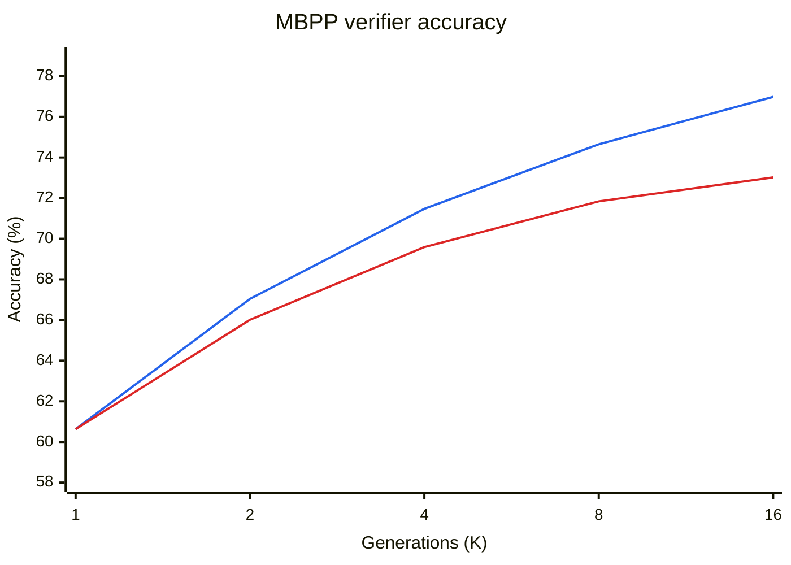
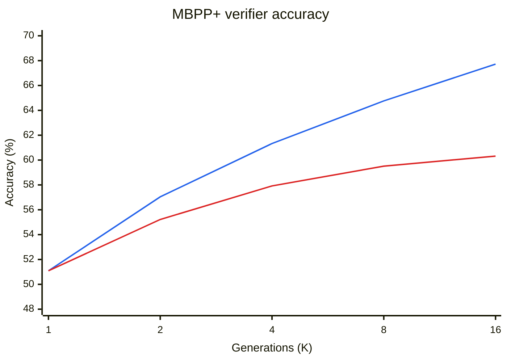

### Summary

I was able to take a very small LLM with under a billion parameters (`Qwen2.5-Coder-0.5B-Instruct`) and boost performance on MBPP through two approaches:

1. Post-training the model through GRPO.
2. Scaling the number of generations at test-time and using a cheap verifier to filter them. The verifier required executing code in a sandbox and clustering similar outputs.

The first technique improved pass@1 by **12.2%** while the second improved by up to **21.6%**, albeit at the cost of higher latency.

### Introduction

Modern LLMs are very powerful, but many performance gains have come from scaling laws. In practice, this often means using more data, compute, and larger models. In some settings, we cannot use that much compute. A model that runs locally may have to fit in very little disk space, RAM, or CUDA memory, especially on a small device.

I wanted to find how much performance I could squeeze out of one of the smallest coding models available, a 0.5B-parameter `Qwen2.5-Coder-0.5B-Instruct`. The next two sections describe the approaches I tried before presenting the full results. Each section starts with the approach that worked, then explains the alternatives that did not work and why.

### 1. Post-training

#### What worked: Hybrid reward with hidden scoring tests

The training prompt showed the task description and one input and output example. The example was the first assertion in the MBPP tests. The model generated a Python function in the open code block. The full test list remained available to the reward function, but only one assertion appeared in the prompt. Here is an example of what the MBPP prompt looks like:

````text
<|im_start|>system
You are an intelligent programming assistant to produce Python algorithmic solutions<|im_end|>

<|im_start|>user
Can you complete the following Python function?
```python
"""
Write a function to find the shared elements from the given two lists.
assert set(similar_elements((3, 4, 5, 6),(5, 7, 4, 10))) == set((4, 5))
"""
```

<|im_end|>
<|im_start|>assistant
```python
````

During training, I used the following reward function. For a generated program $y$, it was:

$$
R(y) = 0.75 \, \mathbf{1}[\text{all tests pass}] + 0.25 \, \frac{n_{\text{passed}}(y)}{n_{\text{total}}}
$$

The indicator is 1 when the program passes every test and 0 otherwise. The value $n_{\text{passed}}(y)$ is the number of tests passed by program $y$, and $n_{\text{total}}$ is the total number of tests for the task. The reward therefore gives most of its weight to full correctness and some credit to partial progress. It scores all available tests, including tests hidden from the prompt.

I optimized this reward with GRPO. Each prompt group contained 16 sampled programs. An optimizer update used eight task groups, for 128 completions in total. The run used the DAPO loss, a learning rate of 1e-5, and a KL coefficient of 0.01. It trained LoRA adapters with rank 16, alpha 32, and dropout 0.05. The random seed was 42, and the maximum completion length was 2,048 tokens.

In the following subsections, I'll explain the other strategies I tried before this and why they *didn't* work.

#### SFT: no reliable improvement

Supervised fine-tuning (SFT) teaches a model to reproduce reference programs. I trained the model on 593 MBPP examples for one epoch. The prompt used the chat template, and the loss applied only to the reference code response. Prompt tokens were masked out.

The response-only training loss was:

$$
L_{\text{SFT}} = -\frac{1}{N} \sum_{t \in \text{response}} \log p_{\theta}(y_t \mid x, y_{<t})
$$

Here, $x$ is the prompt, $y_t$ is the next reference-code token, and $N$ is the number of response tokens. The run used one epoch over the 593 examples, a per-device batch size of 1, AdamW, a linear learning-rate schedule starting at 1e-5, seed 42, and a maximum prompt length of 512 tokens. The held-out evaluation used greedy pass@1 on 90 examples.

Before SFT, pass@1 was 35.6%. After SFT, it fell to 32.3%, so held-out performance did not improve.

One likely reason is that the training set was too small. It contained only 593 examples. The model fit the reference code, but its held-out score fell. This strongly suggests overfitting to the demonstrations.

In contrast, GRPO can produce more training signal from a limited set of prompts. SFT uses one reference program for each example. Meanwhile, GRPO samples 16 fresh programs for a given prompt, effectively multiplying the number of rollouts to learn from by 16. The GRPO training set contained 593 examples.

#### GRPO with binary reward: feedback was too sparse

The first reward I tried gave only two possible scores. A program received 1 if it passed every test and 0 otherwise. For a small coding model, most sampled programs failed, so many groups had little or no difference in their rewards.

The reward was:

$$
r_i = \mathbf{1}[\text{program } i \text{ passes all tests}]
$$

An earlier five-step diagnostic sampled four programs per prompt. Three of the five update batches had zero reward variance, zero loss, and zero gradient norm. Pass@1 fell from 28.0% at baseline to 26.7% at the end. In those three batches, sampled programs did not have different rewards for the optimizer to compare.

This lack of within-group diversity matters because GRPO uses relative rewards to update the policy. For a group of $G$ sampled programs, it computes a normalized advantage:

$$
\hat{A}_i = \frac{r_i - \bar{r}}{\sigma_r + \epsilon}, \qquad \bar{r} = \frac{1}{G} \sum_{j=1}^{G} r_j
$$

Here, $r_i$ is the reward for program $i$, $\bar{r}$ is the mean group reward, and $\sigma_r$ is the group's reward standard deviation. The advantage shows whether each program did better or worse than the others for the same prompt. If every program in a group gets the same binary reward, each reward equals the group mean and every advantage is zero. That group then provides no relative signal for the policy update.

The follow-up dense-reward diagnostic gave partial credit for valid code and test progress. All five updates then had nonzero reward variance and gradient norm. Four updates had mixed rewards in all eight groups, and the fifth had mixed rewards in seven of eight groups. Held-out pass@1 still fell from 28.0% to 25.3%. The denser reward restored a learning signal, but did not establish a correctness gain.

#### GRPO without hidden tests: reward hacking

When trying to understand the lack of improvement in performance, I found a clear case of reward hacking. The first long run showed every expected input and output in the prompt, and the reward tested the program on those same examples. A program could get full reward by memorizing the visible pairs instead of learning the general rule.

At step 960, the training pass rate had increased to 86.3%, while pass@1 on MBPP+ fell to 43.4%, below its 43.7% starting point. A strict code audit classified 27.65% of generations in the late training window as lookup solutions. For example, a generated program could compare its input with the literal values in the prompt and return the matching literal outputs:

```python
if value == <visible_test_input_1>:
    return <visible_test_output_1>
if value == <visible_test_input_2>:
    return <visible_test_output_2>
```

Because the reward tested the same examples shown in the prompt, these programs could earn high training reward without learning a general solution. The training score improved, but the model did not learn a better program for unseen inputs.

#### GRPO with only hidden tests: interface errors

To prevent the reward hacking described above, I removed all input and output examples from the prompt. This prevented direct copying, but left the model to infer the required function interface from the task description. An interface error occurs when the generated code does not use the required function name or arguments, so the evaluator cannot call it. In an audit of 160 generations, 15.6% had an interface error.

This finding led me to the approach described at the start of the section: show the LLM only the first test in the prompt, but calculate reward using both this visible test and the other hidden tests. In this setup, hardcoding the answer to the visible test yields a reward slightly higher than a fully failing solution, but far less than a fully correct solution.

### 2. Scaling test-time generation

#### What worked: execution-based verifier and output clustering

During the previous experiments, I noticed a curious phenomenon. Pass@1 could be low, but sampling more candidates greatly increased the chance of finding a correct solution. In an earlier 80-task rollout, the first candidate to pass the visible test was fully correct on 56.25% of tasks. Among 16 candidates, at least one was fully correct on 67.50% of tasks. On checkpoint 630, raw MBPP pass@K rose from 58.85% at K=1 to 80.42% at K=16. I wanted to investigate the impact of scaling up the number of generations during test time.

##### Execution-based filtering

Even when a batch contains a correct program, we cannot identify it at inference time by checking the ground truth. However, we can make an educated guess about which program is correct using the information available to us. In this setup, we know the ground-truth input and output for one test, and we can execute programs in a sandbox. We can filter out any program that does not produce the expected output on this test, then pick the first program that remains.

##### Joint output clustering

For the other hidden tests, we do not know the ground-truth outputs. However, we can still execute the tests in the sandbox and apply simple heuristics to sharpen our educated guess. I used joint output clustering: for each candidate that had passed the visible test, I ran it on the hidden inputs and recorded its outputs as a signature. I then grouped candidates with identical signatures and selected the earliest candidate in the largest cluster. If no candidate produced a complete signature, I used the execution-based filter's choice.

The idea is that whichever output a plurality of programs produces is likely to be correct. We assume that correct programs produce the same outputs, while incorrect programs may fail in different ways and therefore produce different outputs. This is only a heuristic. Incorrect programs can also agree on the same wrong outputs. In an earlier 80-task analysis, the largest cluster contained a correct program in 48 of the 54 tasks where at least one candidate was correct. It missed six tasks that an oracle with access to hidden-test labels could have solved.

#### Learned verifier: insufficient performance

One alternative I first tried was to train a small verifier to predict whether a program was correct. This is a binary classification problem. I ran an experiment with CodeBERT, a model trained to understand both source code and natural language, and fine-tuned it on MBPP candidates labeled by sandbox execution. The dataset contained 1,495 training examples from 299 tasks and 375 validation examples from 75 tasks.

The best run reached 70.1% validation accuracy and 77.7% area under the ROC curve. A classifier at chance would reach about 50% accuracy, so this was only about 20 percentage points above chance. When I used the verifier's predictions to filter candidates at a 0.5 threshold, performance was poor. Later checkpoints had better AUC but recall as low as 39.6%, so they rejected many correct programs.

We might have obtained better results with a more powerful verifier, but it would require more memory and compute. Those resources could also support a more powerful code-generation model, so a larger verifier would defeat the purpose. Because scaling up the size of the verifier was not worthwhile, I next tried scaling up the size of the dataset.

#### Learned verifier with synthetic data: mismatch in data distribution

As such, my next experiment involved adding synthetic examples to the verifier data. I first tried using `Qwen2.5-Coder-0.5B-Instruct` to generate synthetic examples, but the model was not designed for this task. I then used GPT-5.4 Mini to generate synthetic tasks and asked the Qwen model to solve them. It passed 7 of 1,000 synthetic-task candidates, a 0.7% pass rate. In an earlier MBPP validation run, 298 of 900 sampled programs passed, a 33.1% pass rate. These runs used different sampling setups, so this is not a controlled comparison, but the large gap suggests the synthetic tasks were much harder for the model.

Calibrating synthetic task difficulty seemed difficult, and aligning the distribution of synthetic tasks with existing MBPP tasks was a broader challenge. I did not explore this approach further because the simpler verifier strategies described above performed better without the added cost of generating and exploring synthetic data. Training a verifier remains an open strategy to explore in the future.

### 3. Results

The main evaluation used 378 tasks from EvalPlus 0.3.1 MBPP. The model was `Qwen2.5-Coder-0.5B-Instruct` with a LoRA adapter. The post-trained results use checkpoint 830, which had the highest saved greedy MBPP score. Checkpoint selection used the same benchmark family as the reported results, so these scores are optimistic as held-out estimates.

MBPP uses the benchmark's base tests. MBPP+ adds extra tests, so programs must pass a stricter set of checks. Every row reports the accuracy of one selected program. The generation count is the number of candidates available before choosing that program; a dash means one standard output without a candidate pool.

#### MBPP

| Method | Parameters | # of generations | Relative FLOPs | Pass@1 |
| --- | ---: | ---: | ---: | ---: |
| Baseline: Qwen2.5-Coder Instruct | 0.49B | — | 1.0 | 52.4% |
| Baseline: Qwen2.5-Coder Instruct | 1.54B | — | ~3.1 | 69.2% |
| Baseline: Qwen2.5-Coder Instruct | 3.09B | — | ~6.3 | 73.6% |
| Baseline: Qwen2.5-Coder Instruct | 7.61B | — | ~15.5 | 83.5% |
| Baseline: Qwen2.5-Coder Instruct | 14.7B | — | ~30.0 | 86.2% |
| Baseline: Qwen2.5-Coder Instruct | 32.5B | — | ~66.3 | 90.2% |
| Post-trained | 0.49B | — | 1.0 | 65.1% |
| Post-trained + execution verifier | 0.49B | 1 | 1 | 60.63% |
| Post-trained + execution verifier | 0.49B | 2 | 2 | 65.97% |
| Post-trained + execution verifier | 0.49B | 4 | 4 | 69.40% |
| Post-trained + execution verifier | 0.49B | 8 | 8 | 71.64% |
| Post-trained + execution verifier | 0.49B | 16 | 16 | 72.22% |
| Post-trained + execution verifier + clustering | 0.49B | 1 | 1 | 60.63% |
| Post-trained + execution verifier + clustering | 0.49B | 2 | 2 | 66.01% |
| Post-trained + execution verifier + clustering | 0.49B | 4 | 4 | 69.59% |
| Post-trained + execution verifier + clustering | 0.49B | 8 | 8 | 71.84% |
| Post-trained + execution verifier + clustering | 0.49B | 16 | 16 | 73.02% |

#### MBPP+

| Method | Parameters | # of generations | Relative FLOPs | Pass@1 |
| --- | ---: | ---: | ---: | ---: |
| Baseline: Qwen2.5-Coder Instruct | 0.49B | — | 1.0 | 43.7% |
| Baseline: Qwen2.5-Coder Instruct | 1.54B | — | ~3.1 | 59.4% |
| Baseline: Qwen2.5-Coder Instruct | 3.09B | — | ~6.3 | 62.4% |
| Baseline: Qwen2.5-Coder Instruct | 7.61B | — | ~15.5 | 71.7% |
| Baseline: Qwen2.5-Coder Instruct | 14.7B | — | ~30.0 | 72.8% |
| Baseline: Qwen2.5-Coder Instruct | 32.5B | — | ~66.3 | 75.1% |
| Post-trained | 0.49B | — | 1.0 | 53.2% |
| Post-trained + execution verifier | 0.49B | 1 | 1 | 51.09% |
| Post-trained + execution verifier | 0.49B | 2 | 2 | 55.21% |
| Post-trained + execution verifier | 0.49B | 4 | 4 | 57.80% |
| Post-trained + execution verifier | 0.49B | 8 | 8 | 59.43% |
| Post-trained + execution verifier | 0.49B | 16 | 16 | 60.05% |
| Post-trained + execution verifier + clustering | 0.49B | 1 | 1 | 51.09% |
| Post-trained + execution verifier + clustering | 0.49B | 2 | 2 | 55.22% |
| Post-trained + execution verifier + clustering | 0.49B | 4 | 4 | 57.92% |
| Post-trained + execution verifier + clustering | 0.49B | 8 | 8 | 59.51% |
| Post-trained + execution verifier + clustering | 0.49B | 16 | 16 | 60.32% |

The Instruct baseline scores come from Table 16 of the [Qwen2.5-Coder Technical Report](https://arxiv.org/pdf/2409.12186). Its evaluation setup may differ from our EvalPlus run, so these scores provide model-family context rather than a controlled comparison.

#### Analysis

Post-training improved the 0.5B model's pass@1 from 52.4% to 65.1% on MBPP and from 43.7% to 53.2% on MBPP+. It still trailed the 1.5B Instruct model, which has about three times as many parameters and scored 69.2% and 59.4%.

Scaling up test-time generations and selecting with a verifier raised accuracy further. With 16 candidates, execution filtering plus clustering reached 73.02% on MBPP and 60.32% on MBPP+. Output clustering added a smaller gain on top of execution filtering: 0.80 percentage points on MBPP and 0.27 points on MBPP+ at 16 generations. Clustering requires roughly two to three times as many sandbox executions. If sandbox execution is a bottleneck, the execution filter alone may be the better choice.

#### Verifier accuracy

To measure verifier accuracy, I compared our selector with a hypothetical perfect verifier. The perfect verifier identifies a correct solution whenever one exists in the candidate pool. The graphs compare this upper bound with execution filtering plus joint output clustering on MBPP and MBPP+.





The gap between the lines represents verifier errors. It is larger on MBPP+, which suggests that verification is more difficult when correctness depends on the more complex MBPP+ tests.

#### Compute and latency trade-offs

Scaling test-time generation can raise accuracy substantially. Relative FLOPs estimate model-generation compute from parameter count and generation count, normalized to one 0.5B generation. Thus, one 1.5B generation costs about three relative FLOPs, as do three 0.5B generations. These estimates do not include sandbox execution.

At similar relative FLOPs, the verifier strategy did not give higher accuracy per FLOP. For example, the 1.5B baseline uses about three relative FLOPs and scores 69.2% on MBPP and 59.4% on MBPP+. The two-generation 0.5B selector uses two relative FLOPs and scores 66.01% and 55.22%. These comparisons are approximate because the baseline report and our EvalPlus evaluation use different setups.

If the GPU has enough memory to generate candidates in parallel, the 0.5B model can produce several candidates with latency closer to one small-model generation while approaching the accuracy of a larger model. If candidates are generated sequentially, latency increases. The model weights still need only the disk space and CUDA memory of the 0.5B model, which can help when those resources are limited.
