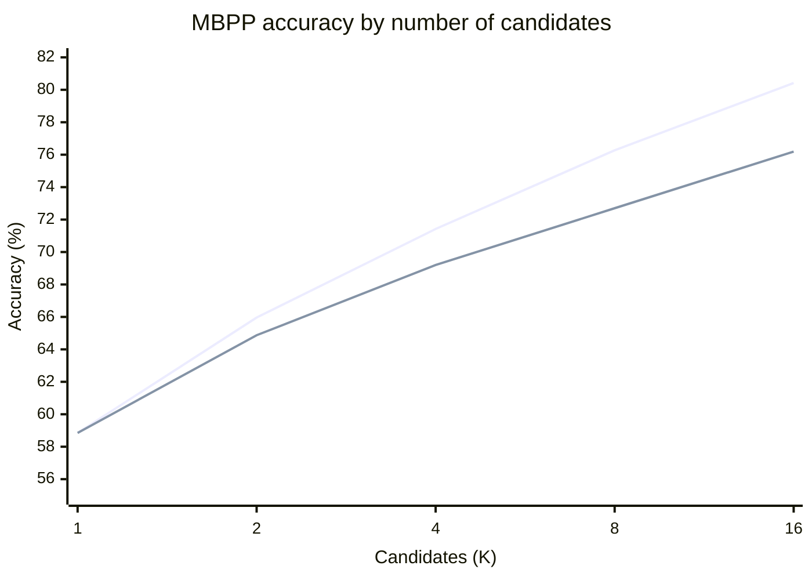
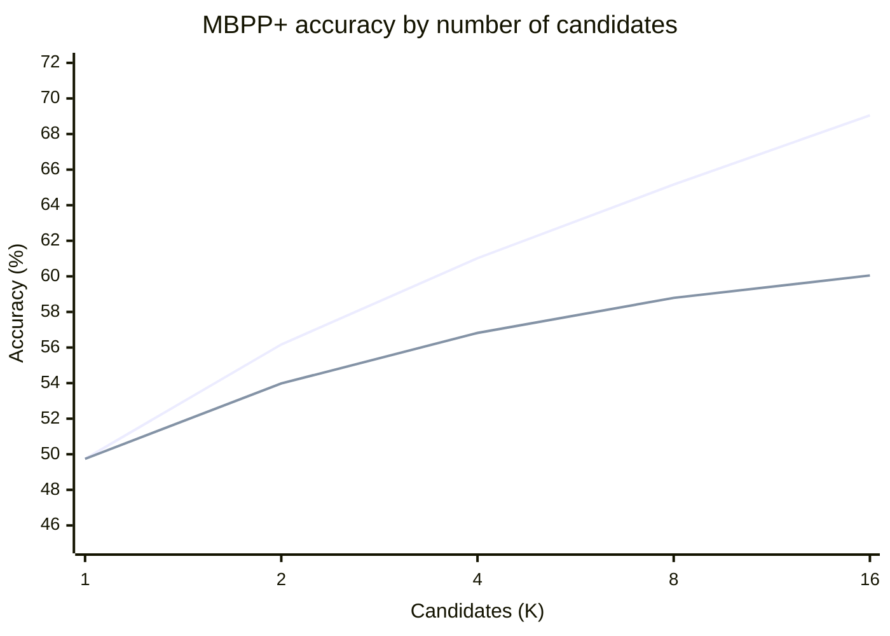

### Summary

The supplied zero-shot reference for Qwen2.5-Coder Base 0.5B is 52.9% on MBPP. The Qwen2.5-Coder-0.5B-Instruct adapter reached 65.1% greedy accuracy at checkpoint 830. That is a contrast of 12.2 percentage points.

Sampling more solutions and selecting with an execution verifier plus joint output clustering reached 76.19% MBPP accuracy at checkpoint 630 with 16 candidates. This is 23.29 points above the 52.9% baseline. It costs more inference work and can increase response time.

The training method used group relative policy optimization, or GRPO, with a hybrid reward. The verifier first ran each candidate against one known input and output pair. It then grouped candidate outputs on the remaining MBPP inputs without reading the expected answers. The verifier selected a candidate from the largest output cluster.

The two headline gains use different evaluation settings. The 12.2 point result compares greedy scores from two different model variants. The 23.29 point result compares a 16-candidate selection score with the supplied zero-shot reference. Checkpoint 830 produced the best saved greedy MBPP score, while checkpoint 630 produced the 76.19% verifier result. Both checkpoints were chosen using the same benchmark family used for reporting, so these figures have selection bias. Treat the gains as useful context, not as a matched estimate of GRPO alone. The rest of this post explains how the training and selection methods developed, what failed, and what the measurements do and do not show.

### 1. Training the 0.5B model

I wanted to improve a small coding model without relying on a larger model at inference time. The training data came from MBPP. The evaluation used the EvalPlus MBPP and MBPP+ benchmarks.

The main training result came from Qwen2.5-Coder-0.5B-Instruct with a LoRA adapter. GRPO used groups of 16 generated programs. Its hybrid reward combined full-test correctness with partial test progress. This gave the optimizer a stronger signal than a single pass or fail value.

#### Solution: GRPO with a hybrid reward and hidden scoring tests

The final training prompt showed one input and output example. The reward function scored the program on all available tests, including tests that were not shown in the prompt. The single example taught the model the function interface. The hidden scoring tests encouraged it to learn the general behavior.

The hybrid reward gave credit for both full correctness and partial test progress. In the main run, it was 75% full-pass reward and 25% fraction of tests passed. This let GRPO distinguish some partially correct programs from programs that failed every test.

The training evidence supports a real gain, with important limits. The run reached 86.3% greedy pass@1 on its training pool at step 960, while MBPP+ evaluation fell to 43.4%. This was a failed checkpoint, not the final result. It revealed reward hacking. In a later run, the selected checkpoint reached 65.1% greedy pass@1 on MBPP and 53.2% on MBPP+.

The central lesson was to keep the answer to one example in the prompt, but hold the remaining tests back from the model. The reward could still run those tests. This reduced the direct path to memorizing every expected input and output.

#### Failed approach: SFT did not give a reliable gain

Supervised fine-tuning, or SFT, trains the model to imitate reference programs. I trained Qwen2.5-Coder-0.5B-Instruct on 374 MBPP examples. The model's held-out greedy pass@1 was 35.6% before SFT. It measured 32.2% at steps 94 and 187. A separate 20-example, 16-generation check gave pass@1 of 15% for the SFT model and 20% for the base model. The SFT model had higher pass@16 coverage, 45% versus 35%, on that small sample.

These measurements do not show that SFT can never help. They show that this SFT run did not provide a reliable greedy improvement. A likely reason is that 374 reference programs gave limited coverage of the ways each problem can be solved. Imitating those examples did not ensure that the model could generalize to new tests. The 20-example result is too small to settle the question, and the held-out trajectory used a limited number of checkpoints.

#### Failed approach: a binary reward was too sparse

The first GRPO reward used only full correctness. A completion received a positive reward if it passed every test and zero otherwise. This made the reward easy to interpret, but it gave no ranking signal when every completion in a group failed.

GRPO compares rewards inside each group. If all 16 programs receive the same reward, their relative advantages are equal. The optimizer then has no useful preference among them. This is likely for a small model that often produces incorrect code.

The later 0.5B run used a hybrid reward. Its first 128-completion batch had a 17.97% full-pass fraction. That is a small positive pool, even before splitting completions into groups. This batch is not a controlled comparison between binary and hybrid rewards, but it shows why a binary-only signal can be sparse for this model.

#### Failed approach: hybrid reward with every answer exposed

Adding partial test credit gave GRPO a training signal, but it did not protect against leakage. In the first long run, the prompt showed all the inputs and expected outputs that the reward function later checked. A program that memorized those examples could receive full reward without implementing the general rule.

The effect was visible in the training record. By step 960, training pass@1 reached 86.3%, while MBPP+ pass@1 fell from 43.7% at initialization to 43.4%. An audit found that lookup-style programs became common. They made up about 54% of full-pass rollouts in steps 850 to 969. The benchmark output audit found visible-example specialization in 91 of 378 tasks at step 960, compared with none at step zero.

The reward was measuring agreement with the examples in the prompt. It was not measuring generalization. More training made this mismatch worse.

#### Failed approach: hiding every example

Removing all expected input and output examples avoided that direct leakage. It also made the task harder for the model. The model had to infer the required function interface from the description alone. Interface errors became a recurring failure mode, especially when the generated function used the wrong name or argument count.

I did not find a matched final benchmark table for the all-hidden prompt variant. Earlier baseline audits show that interface errors were real. For example, one 160-generation audit found 25 interface contract failures. These audits do not isolate the effect of hiding every example, so the causal link is a working explanation rather than a measured ablation.

#### Working prompt: show one example and score the rest

The compromise was to retain one input and output example in the prompt and hide the remaining tests. The visible example taught the function shape. The reward still evaluated the full test set. This design made it harder to earn reward by copying all known answers.

This change addressed the observed reward leak. It did not remove every limitation. The training run still used one random seed, and the final checkpoint selection used scores from the same benchmark family as the results. The next section describes a second source of improvement: selecting among several programs from one trained model.

### 2. Selecting among multiple generations

GRPO training gave the model more useful solutions, but a single greedy answer did not expose everything the model could do. This led to a separate question. If the model samples several programs, can a cheap verifier identify a better one?

#### Diagnostic: pass@K revealed answers the first sample missed

Pass@K measures whether a set of K samples contains at least one correct program. I checked it because GRPO had exposed a problem with groups that lacked both positive and negative rewards. I wanted to know whether the trained model produced a mix of correct and incorrect programs once its prompt and reward were working.

The answer was yes. In an earlier 80-task rollout analysis, the best of 16 samples was correct on 67.50% of tasks. The first visible-test-passing candidate was correct on 56.25%. A perfect oracle that knew the full-test labels could select a correct sample whenever one existed. That oracle reached 67.50% at K=16.

The oracle is only a diagnostic upper bound. It uses the labels that a real verifier must not see. It shows that sampling can expose useful answers. It does not provide a deployable selection method. The latest frozen-checkpoint evaluation also showed rising raw MBPP pass@K, from 58.85% at K=1 to 80.42% at K=16 for checkpoint 630.

#### Failed approach: train a binary verifier

I also tried a learned verifier. It treated candidate selection as binary classification. The verifier received a task and a generated program, then predicted whether to keep the program. A CodeBERT verifier was trained on MBPP tasks, with generated candidates labeled by sandbox execution.

This was a plausible task, but the labeled set was small. The saved dataset had 1,495 training candidates from 299 tasks and 375 validation candidates from 75 tasks. The best run reached 70.1% validation accuracy and 77.7% area under the ROC curve. Later runs showed threshold calibration problems. A checkpoint could improve AUC while its fixed 0.5 threshold produced poor recall.

These results were not strong enough to establish a reliable candidate selector for the coding model. A more capable verifier might improve classification, but it would use more memory and compute. At that point, spending those resources on a stronger code model could be a better use of the budget.

#### Failed approach: generate synthetic verifier examples

I tried creating synthetic examples to increase the verifier's training data. A small model was not reliable enough to produce consistently useful examples. A stronger model could produce better examples, but it also changed the data distribution. The synthetic cases came from GPT-5 mini, while the benchmark tasks and model generations came from a different source.

The synthetic cases also appeared harder than the existing cases. This made it unclear whether a verifier trained on them would learn the distinctions needed for the real candidate pool. I did not find a controlled, numeric difficulty comparison in the saved reports. The difficulty mismatch is therefore a qualitative observation, and I stopped before spending more time on calibration.

#### Failed approach: a static lookup detector

A hand-written detector looked for code that matched literal test inputs and returned literal outputs. This was intended to reject hardcoded lookup solutions after they passed the visible assertion.

On an 80-task sample, 516 candidates passed the visible assertion. The detector rejected none of them. Its rules needed more than one matching example to identify a lookup table, while the verifier could see only one example. The filter therefore produced the same result as visible-test selection alone.

#### Working approach: execute one known assertion

Instead of predicting correctness with another model, I used a sandbox to run each candidate against the one assertion shown in the prompt. This is deterministic. It returns a clear pass or fail for that assertion.

The selector chose the first candidate that passed. If no candidate passed, it kept the first candidate. It did not execute the full hidden benchmark tests or read their expected outputs. On the latest evaluation, execution-only selection reached 75.40% MBPP pass@16 for checkpoint 630.

One visible assertion is a weak correctness test. Some incorrect programs can pass it. The method is useful because execution is cheap and exact for the check it performs, not because one example proves a program correct.

#### Working approach: cluster outputs across hidden inputs

I then asked whether hidden test inputs could provide additional information without exposing their expected answers. For each candidate that passed the visible assertion, the sandbox ran the program on the remaining MBPP inputs. It recorded the returned values. It did not compare those values with the expected outputs.

I tried two simple selection rules. The first formed a joint signature from each candidate's outputs on all hidden inputs, then selected from the largest exact cluster. The second found the most common output for each input and selected a candidate that matched the most common outputs. The joint cluster and per-input plurality gave nearly the same result in the earlier 80-task diagnostic. At K=16, both reached 60.00%, above the 56.25% visible-only selector.

The latest evaluation used exact typed output signatures. It selected the earliest candidate in the largest cluster among candidates that passed the visible assertion and returned a complete output signature. If no complete signature was available, it fell back to visible-test selection. At checkpoint 630, the combined selector reached 76.19% MBPP pass@16. This was 0.79 points above execution-only selection on the same candidate pool. On MBPP+, it reached 60.05%, or 0.53 points above execution-only selection.

The intuition is that correct programs tend to agree on their outputs. Incorrect programs may fail in different ways. This is a heuristic, not a proof. A large cluster can agree on the same wrong answer. In the earlier 80-task analysis, the largest cluster contained a correct candidate in 48 of 54 tasks where any of the 16 candidates was correct. It missed six tasks that the oracle could have solved.

### 3. Results

The main benchmark run used the EvalPlus 0.3.1 MBPP release with 378 tasks. The model was Qwen2.5-Coder-0.5B-Instruct with a LoRA adapter. Each checkpoint produced 16 candidates per task at temperature 1.0. The verifier made its decisions before benchmark correctness labels were read.

The raw pass@K rows use the standard estimate of whether at least one of K samples is correct. Verifier rows measure the accuracy of the selected candidate, averaged over all uniformly selected subsets of K candidates. A verifier result can be lower than raw pass@K because the raw estimate only asks whether a correct candidate exists. The verifier must choose one candidate without seeing the answer.

Checkpoint 830 had the best saved greedy MBPP score. Checkpoint 630 had the best saved greedy MBPP+ score. The checkpoints were selected from the same benchmark family reported here, so the table is optimistic as a held-out estimate.

#### MBPP base tests

| Model or method | Checkpoint | Greedy pass@1 | pass@1 | pass@2 | pass@4 | pass@8 | pass@16 |
| --- | ---: | ---: | ---: | ---: | ---: | ---: | ---: |
| Qwen2.5-Coder Base 0.5B, zero-shot reference | — | 52.9% | — | — | — | — | — |
| Raw sampling | 630 | 64.0% | 58.85% | 65.96% | 71.42% | 76.27% | 80.42% |
| Execution verifier | 630 | 64.0% | 58.85% | 64.86% | 69.11% | 72.69% | 75.40% |
| Execution verifier plus joint output clustering | 630 | 64.0% | 58.85% | 64.87% | 69.20% | 72.70% | 76.19% |
| Raw sampling | 830 | 65.1% | 60.63% | 67.04% | 71.47% | 74.65% | 76.98% |
| Execution verifier | 830 | 65.1% | 60.63% | 65.97% | 69.40% | 71.64% | 72.22% |
| Execution verifier plus joint output clustering | 830 | 65.1% | 60.63% | 66.01% | 69.59% | 71.84% | 73.02% |

The 65.1% greedy score at checkpoint 830 is 12.2 percentage points above the supplied 52.9% zero-shot reference. The 76.19% selected-candidate score at checkpoint 630 is 23.29 points above that reference. The reference uses Qwen2.5-Coder Base, while training started from Qwen2.5-Coder-Instruct. The second comparison also uses 16 sampled candidates and a different checkpoint. Neither difference isolates the causal effect of GRPO or the verifier.

#### MBPP+ base and extra tests

| Model or method | Checkpoint | Greedy pass@1 | pass@1 | pass@2 | pass@4 | pass@8 | pass@16 |
| --- | ---: | ---: | ---: | ---: | ---: | ---: | ---: |
| Qwen2.5-Coder Base 0.5B, zero-shot reference | — | 47.1% | — | — | — | — | — |
| Raw sampling | 630 | 54.0% | 49.74% | 56.17% | 61.02% | 65.16% | 69.05% |
| Execution verifier | 630 | 54.0% | 49.74% | 53.98% | 56.69% | 58.61% | 59.52% |
| Execution verifier plus joint output clustering | 630 | 54.0% | 49.74% | 53.98% | 56.82% | 58.79% | 60.05% |
| Raw sampling | 830 | 53.2% | 51.09% | 57.04% | 61.33% | 64.76% | 67.72% |
| Execution verifier | 830 | 53.2% | 51.09% | 55.21% | 57.80% | 59.43% | 60.05% |
| Execution verifier plus joint output clustering | 830 | 53.2% | 51.09% | 55.22% | 57.92% | 59.51% | 60.32% |

The verifier improvement over execution-only selection is smaller than the gain from GRPO. At checkpoint 830, clustering added 0.80 points at pass@16 on MBPP and 0.27 points on MBPP+. At checkpoint 630, it added 0.79 points on MBPP and 0.53 points on MBPP+. The strongest result comes from combining the trained model with multiple samples and a verifier. Each component has a separate effect.

#### Performance as the candidate pool grows

These charts show raw sampling and execution plus joint output clustering for checkpoint 630. The first line is raw sampling. The second line is the combined selector. The charts do not include the oracle.

The curves show two different quantities. Raw pass@K rises when the candidate pool has a better chance of containing a correct program. The selector's score depends on whether its rule can identify that program. Output clustering improves on execution-only selection, but it does not match the raw oracle-free candidate coverage.

#### Reproduction details

The benchmark run used W&B run `c4fthzd3`, source commit `ba8b794085828aef55d617ac1d2b7a20dd2dee89`, Python 3.12, PyTorch 2.8.0+cu128, and one NVIDIA RTX 2000 Ada Generation GPU with 16,380 MiB of memory. The dataset was EvalPlus 0.3.1 MBPP, with 378 tasks and hash `ee43ecabebf20deef4bb776a405ac5b1`. Sampling used vLLM 0.10.2, temperature 1.0, top-p 1.0, seed 42, and a 2,048-token output limit.

### 4. Model size, latency, and limits

The table below gives the supplied zero-shot reference scores for Qwen2.5-Coder Base models. These are context scores, not a controlled comparison with the Qwen2.5-Coder-Instruct adapter used in the experiments. The small model uses much less parameter memory and disk space. Larger models have higher accuracy without post-training or multiple candidate selection.

| Qwen2.5-Coder Base | Parameters | MBPP 0-shot | MBPP+ | MBPP 3-shot |
| --- | ---: | ---: | ---: | ---: |
| 0.5B | 0.49B | 52.9% | 47.1% | 40.4% |
| 1.5B | 1.54B | 69.2% | 58.6% | 59.2% |
| 3B | 3.09B | 72.2% | 61.4% | 65.2% |
| 7B | 7.61B | 76.9% | 62.9% | 68.8% |
| 14B | 14.7B | 81.0% | 66.7% | 71.4% |
| 32B | 32.5B | 83.0% | 68.2% | 76.4% |

A larger model can produce one answer with lower latency than 16 sequential samples from a smaller model. It also needs more memory and disk space. A small model can fit on hardware with limited RAM or CUDA memory. Sequential sampling keeps peak memory lower than generating all candidates at once, but it increases response time.

The benchmark run generated all 16 candidates for each task before scoring. It did not measure sequential early stopping after the first candidate passed the execution filter. The saved artifacts also do not provide a reliable average count of generations to first pass, per-request token counts, or matched wall-clock and FLOP measurements against the larger models. I therefore cannot claim that this approach is more compute-efficient at equal FLOPs.

The result is most useful when memory or model storage is the binding constraint and response time is flexible. It is less attractive when the user needs a fast answer or when a larger model fits within the available hardware budget. A practical deployment should measure latency, energy, and generation count under its own prompts and sandbox limits.

There are four more limits to keep in mind.

- The training and verifier evaluations use one seed. The observed gains need replication.
- The chosen checkpoints were selected using the same benchmark family used for reporting. This introduces selection bias.
- The verifier uses MBPP inputs and one prompt-visible assertion. Its output agreement may not transfer to inputs from a different distribution.
- Output agreement is not proof of correctness. Several wrong programs can agree with one another.

A 0.5B coding model can benefit from both post-training and candidate selection. GRPO improved the saved greedy MBPP score. A hybrid reward gave the optimizer partial progress, and hiding most expected outputs reduced one clear route to reward hacking. Sampling exposed more correct programs than greedy decoding. A deterministic execution check and answer-blind output clustering selected better candidates than the visible assertion alone.

The method trades inference work and response time for lower memory requirements. The current evidence supports that tradeoff on MBPP. It does not establish a general compute advantage or a held-out estimate. The next useful step is to repeat the benchmark with an independent checkpoint-selection split and record sequential verifier latency and generation counts.
