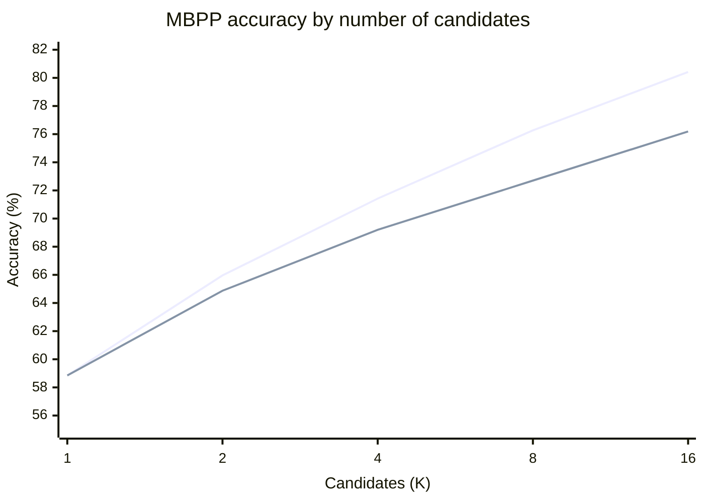
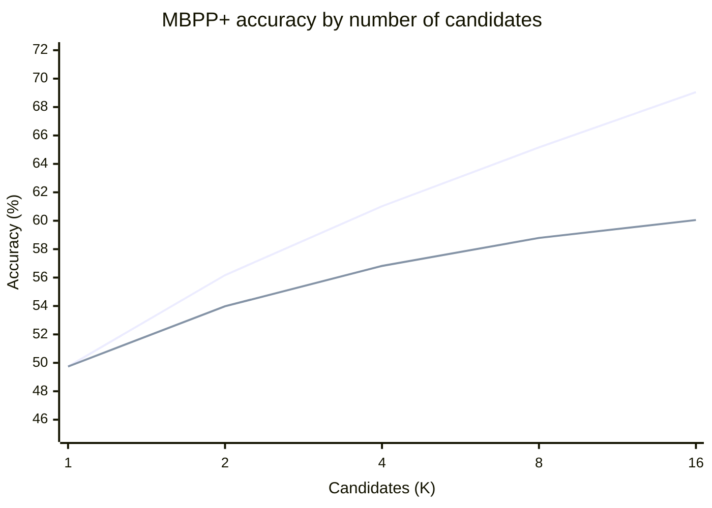

### Summary

A 0.5B coding model is small enough to run where memory or model storage is limited, but its first answer is often wrong. I tested two ways to make this model more useful without replacing it with a larger one. First, I used GRPO post-training to improve its code generation. Then I sampled several answers and used a lightweight verifier to choose among them.

The best saved greedy result reached 65.1% on MBPP. With 16 sampled programs, execution checks and output clustering selected a program that passed MBPP on 76.19% of tasks. An official Instruct score provides a reference point, although its evaluation setup differs from ours. The second result also uses more inference work.

The route to these results mattered. SFT did not improve the model reliably. GRPO with a binary reward gave too little feedback, while showing every expected answer made it easy to memorize the tests. Hiding every example caused interface errors. Showing one example and scoring the rest gave the model an interface hint while keeping most answers hidden. Sampling then showed that correct programs were often present even when the first answer failed. That observation led from learned verifiers to a deterministic execution check, then to clustering candidate outputs without reading the hidden answers.

This post follows that sequence. It describes the training choices, the verifier experiments, the benchmark results, and the tradeoff between a small model with more sampling and a larger model with one answer.

### 1. Training a 0.5B coding model

I wanted to improve a coding model that could fit within a small memory and storage budget. The model was Qwen2.5-Coder-0.5B-Instruct with a LoRA adapter. Training examples came from MBPP. I evaluated saved checkpoints with EvalPlus MBPP and MBPP+.

#### The workable setup: hybrid reward with hidden scoring tests

The approach that worked combined GRPO with a hybrid reward and a prompt that showed one input and output pair. The reward tested each program on all available tests, including the tests hidden from the prompt. It assigned 75% of the reward to passing every test and 25% to the fraction of tests passed. The visible pair showed the model the expected function interface. The hidden tests made it harder to earn a high reward by copying every known answer.

The best saved greedy checkpoint reached 65.1% on MBPP. The best saved MBPP+ checkpoint reached 53.2%. These scores show what the final setup achieved. The earlier attempts explain why it used both partial test credit and a single visible example.

#### SFT did not give a reliable improvement

I first used supervised fine-tuning (SFT) to train on 374 MBPP examples. SFT asks the model to imitate reference programs. The held-out greedy pass@1 score was 35.6% before SFT and 32.2% at steps 94 and 187. In a separate check on 20 examples with 16 generations per example, SFT had 15% pass@1 versus 20% for the base model. It did have higher pass@16 coverage in that small check, 45% versus 35%.

These results did not show a reliable greedy improvement. One likely reason is that 374 programs covered too few of the ways to solve the tasks. Imitation alone did not ensure that the model would generalize to new tests. The 20-example check was small, so it cannot establish that SFT never helps.

#### A binary GRPO reward gave too little feedback

I next tried GRPO with a binary reward. A program received a positive reward only if it passed every test. Otherwise, it received zero. This reward was easy to interpret, but it did not distinguish a program that passed some tests from one that passed none.

GRPO compares rewards among programs in a group. If every program in a group gets the same reward, the group provides no useful preference for updating the policy. This can happen often when a small model produces mostly incorrect programs. In the later hybrid-reward run, the first batch of 128 completions had a 17.97% full-pass fraction. This is not a controlled comparison of the two reward functions, but it shows why a binary reward could leave many groups with little signal.

#### Showing every expected answer led to lookup solutions

Adding partial-test credit gave GRPO more feedback, but the first long run showed every expected input and output in the prompt. The reward then tested the program on those same examples. A program could get full reward by memorizing the visible pairs instead of learning the general rule.

The training and evaluation results diverged. At step 960, training pass@1 reached 86.3%, while MBPP+ pass@1 fell from 43.7% at initialization to 43.4%. An audit found lookup-style programs in about 54% of full-pass rollouts from steps 850 to 969. On the benchmark, 91 of 378 tasks showed visible-example specialization at step 960, compared with none at step zero. These results indicated that the reward encouraged memorization of prompt-visible answers.

#### Hiding every example caused interface errors

Removing all input and output examples prevented direct copying, but left the model to infer the required function interface from the description. Interface errors became a recurring problem. One earlier audit of 160 generations found 25 contract failures.

I did not find a matched benchmark comparison for the all-hidden prompt. The audit confirms that interface errors occurred, but it does not isolate how many the all-hidden prompt caused. The likely explanation is that removing every example also removed a useful interface cue.

The failed attempts explain the role of each part of the final prompt. The hybrid reward supplied partial feedback when programs failed some tests. One visible example supplied the function interface. Hidden scoring tests reduced the direct path to memorizing every expected answer. The selected checkpoints are discussed with the full benchmark results below. Checkpoint selection used the same benchmark family, so the scores are not an independent estimate of generalization.

That training result raised the next question. If one answer is sometimes wrong, could the model produce a correct answer among several samples, and could a cheap rule identify it?

### 2. Selecting among multiple generations

I began by measuring pass@K, which asks whether at least one of K generated programs is correct. This check followed directly from the GRPO problem: a group needs variation in reward to provide a learning signal. I wanted to see whether the trained model produced useful variation once the prompt and reward were working.

It did. In an earlier 80-task rollout, the first candidate that passed the visible assertion was correct on 56.25% of tasks. The best of 16 candidates was correct on 67.50%. A perfect oracle that knew all hidden-test labels could select a correct program on those same 67.50% of tasks. This oracle result is only an upper bound because a real selector cannot see the labels. It showed, however, that sampling could expose correct programs the first candidate missed.

The frozen-checkpoint evaluation showed the same pattern. For checkpoint 630, raw MBPP pass@K rose from 58.85% at K=1 to 80.42% at K=16. The remaining problem was selection. Sampling more candidates helps only if a selector can choose a good one without reading the answer.

#### A learned verifier did not provide a reliable selector

I first treated selection as binary classification. A verifier would receive a task and a candidate program, then predict whether to keep it. The available saved experiment trained a CodeBERT verifier on MBPP candidates labeled by sandbox execution. It had 1,495 training candidates from 299 tasks and 375 validation candidates from 75 tasks. The best run reached 70.1% validation accuracy and 77.7% area under the ROC curve. Later runs exposed threshold problems: a checkpoint could have better AUC but poor recall at the fixed 0.5 threshold.

The results did not establish a reliable selector. The training set was small, much like the SFT data. A more powerful verifier might do better, but it would need additional memory and compute. If that extra capacity is available, using it to generate better code directly may be a better use of the budget.

#### Synthetic examples did not solve the data problem

I also considered adding synthetic examples to the verifier data. The 0.5B model was not strong enough to produce consistently useful examples. GPT-5 mini produced stronger examples, but those examples came from a different source than the benchmark tasks and candidate programs. They also appeared harder to solve than the existing cases.

I did not find a controlled numerical difficulty comparison in the saved reports. The difficulty difference is a qualitative observation, not a measured result. Calibrating synthetic difficulty would have required more work, and it was unclear whether the resulting examples would match the cases the verifier needed to distinguish.

#### A static lookup detector rejected no candidates

A hand-written detector looked for programs that returned literal outputs for literal test inputs. It was meant to reject lookup solutions that passed the visible assertion. In an 80-task sample, 516 candidates passed that assertion, and the detector rejected none. The rules needed more than one matching example to identify a lookup table, but the verifier had only one visible example. This detector therefore added no filtering value.

#### Executing the visible assertion gave a dependable first filter

Instead of predicting correctness with another model, I ran each candidate in a sandbox against the one assertion shown in the prompt. The sandbox returned a deterministic pass or fail for that check. The selector chose the first candidate that passed. If none passed, it kept the first candidate.

This simple filter reached 75.40% MBPP accuracy at pass@16 for checkpoint 630. It did not run the full hidden benchmark tests or read their expected outputs. One assertion is weak evidence: an incorrect program can pass it. Execution is useful here because it gives an exact result for a cheap, known check.

#### Clustering hidden outputs added a small further gain

I then tested whether hidden inputs could provide more evidence without comparing candidate outputs with the expected answers. For each candidate that passed the visible assertion, the sandbox ran the program on the remaining MBPP inputs. It recorded the outputs but did not check them against the hidden labels.

I compared joint output clustering with per-input plurality. Joint clustering groups candidates that produce the same output signature over the hidden inputs. Per-input plurality favors a candidate whose outputs match the most common output for each input. In an earlier 80-task diagnostic, the two rules performed nearly the same. At K=16, each selected a correct candidate on 60.00% of tasks, compared with 56.25% for visible-assertion selection.

The latest evaluation used exact typed output signatures and selected the earliest candidate in the largest cluster among candidates that passed the visible assertion and returned a complete signature. If none had a complete signature, it fell back to the visible-assertion selector. At checkpoint 630, the combined selector reached 76.19% MBPP accuracy at pass@16, up 0.79 points from execution-only selection. On MBPP+, it reached 60.05%, up 0.53 points.

The idea is that correct programs should often agree on outputs, while wrong programs may fail in different ways. Agreement is only a heuristic. Several incorrect programs can agree on the same wrong outputs. In the earlier 80-task analysis, the largest cluster contained a correct program in 48 of the 54 tasks where any sample was correct. It missed six tasks that the oracle could have solved.

The results show that each step addressed a specific weakness. The assertion check removed candidates that failed a known example. Output clustering used answer-blind agreement to improve selection a little further. Neither method can identify every correct candidate, so the next section compares the measured results and explains how much the added sampling costs.

### 3. Results

The main evaluation used 378 tasks from EvalPlus 0.3.1 MBPP. The model was Qwen2.5-Coder-0.5B-Instruct with a LoRA adapter. Each checkpoint had 16 sampled programs per task. Sampling used temperature 1.0. The verifier made its decisions before benchmark correctness labels were read.

The tables report two kinds of scores. Raw pass@K estimates whether at least one of K samples is correct. Verifier accuracy measures whether the selector chose a correct candidate, averaged over uniformly selected subsets of K candidates. These values answer different questions. A selector can score below raw pass@K because it must choose without knowing which candidates pass all tests.

Checkpoint 830 had the best saved greedy MBPP score. Checkpoint 630 had the best saved greedy MBPP+ score. Both were selected from the same benchmark family used for reporting, so the results are optimistic as held-out estimates.

#### MBPP base tests

| Model or method | Checkpoint | Greedy pass@1 | pass@1 | pass@2 | pass@4 | pass@8 | pass@16 |
| --- | ---: | ---: | ---: | ---: | ---: | ---: | ---: |
| Qwen2.5-Coder-0.5B-Instruct, official reference | — | 52.4% | — | — | — | — | — |
| Raw sampling | 630 | 64.0% | 58.85% | 65.96% | 71.42% | 76.27% | 80.42% |
| Execution verifier | 630 | 64.0% | 58.85% | 64.86% | 69.11% | 72.69% | 75.40% |
| Execution verifier plus joint output clustering | 630 | 64.0% | 58.85% | 64.87% | 69.20% | 72.70% | 76.19% |
| Raw sampling | 830 | 65.1% | 60.63% | 67.04% | 71.47% | 74.65% | 76.98% |
| Execution verifier | 830 | 65.1% | 60.63% | 65.97% | 69.40% | 71.64% | 72.22% |
| Execution verifier plus joint output clustering | 830 | 65.1% | 60.63% | 66.01% | 69.59% | 71.84% | 73.02% |

The checkpoint 830 greedy result is 12.7 percentage points above the official 52.4% Instruct reference. The checkpoint 630 selector result at K=16 is 23.79 points above it. The official report and our EvalPlus run use different evaluation setups. The model family matches, but these differences are not controlled estimates of the effects of GRPO or verification. The K=16 result also uses more inference work and a different checkpoint.

#### MBPP+ base and extra tests

| Model or method | Checkpoint | Greedy pass@1 | pass@1 | pass@2 | pass@4 | pass@8 | pass@16 |
| --- | ---: | ---: | ---: | ---: | ---: | ---: | ---: |
| Qwen2.5-Coder-0.5B-Instruct, official reference | — | 43.7% | — | — | — | — | — |
| Raw sampling | 630 | 54.0% | 49.74% | 56.17% | 61.02% | 65.16% | 69.05% |
| Execution verifier | 630 | 54.0% | 49.74% | 53.98% | 56.69% | 58.61% | 59.52% |
| Execution verifier plus joint output clustering | 630 | 54.0% | 49.74% | 53.98% | 56.82% | 58.79% | 60.05% |
| Raw sampling | 830 | 53.2% | 51.09% | 57.04% | 61.33% | 64.76% | 67.72% |
| Execution verifier | 830 | 53.2% | 51.09% | 55.21% | 57.80% | 59.43% | 60.05% |
| Execution verifier plus joint output clustering | 830 | 53.2% | 51.09% | 55.22% | 57.92% | 59.51% | 60.32% |

Output clustering added less than one percentage point over execution-only selection at K=16. It added 0.79 points on MBPP and 0.53 points on MBPP+ for checkpoint 630. For checkpoint 830, the gains were 0.80 and 0.27 points. Most of the improvement came from combining the post-trained model with multiple samples and a selector. Clustering made a smaller further contribution.

#### Accuracy as the candidate pool grows

These charts show raw sampling and the combined execution and clustering selector for checkpoint 630. They do not show the oracle. Raw pass@K measures whether a correct program is present. The selector lines measure whether the method chose one.

The gap between the lines is the cost of not knowing which candidate passes the full benchmark. Sampling increases the chance that the pool contains a correct program. The verifier uses available evidence to choose, but cannot reproduce a perfect oracle.

#### Reproduction details

The benchmark run used W&B run `c4fthzd3` and source commit `ba8b794085828aef55d617ac1d2b7a20dd2dee89`. It used Python 3.12, PyTorch 2.8.0+cu128, and one NVIDIA RTX 2000 Ada Generation GPU with 16,380 MiB of memory. The data was EvalPlus 0.3.1 MBPP with 378 tasks and hash `ee43ecabebf20deef4bb776a405ac5b1`. Sampling used vLLM 0.10.2, temperature 1.0, top-p 1.0, seed 42, and a 2,048-token output limit.

### 4. Model size, latency, and limits

The Instruct model scores below give context for the 0.5B result. They also show what is gained by using a larger model without post-training or candidate selection. The small model uses less memory and disk space. Sampling it more can improve accuracy, but costs additional time and inference work.

| Qwen2.5-Coder Instruct | Parameters | MBPP | MBPP+ |
| --- | ---: | ---: | ---: |
| 0.5B | 0.49B | 52.4% | 43.7% |
| 1.5B | 1.54B | 69.2% | 59.4% |
| 3B | 3.09B | 73.6% | 62.4% |
| 7B | 7.61B | 83.5% | 71.7% |
| 14B | 14.7B | 86.2% | 72.8% |
| 32B | 32.5B | 90.2% | 75.1% |

Source: [Qwen2.5-Coder Technical Report](https://arxiv.org/pdf/2409.12186), Table 16. The report does not list an MBPP 3-shot score for Instruct models. Its evaluation setup may differ from our EvalPlus run, so these scores are a model-family reference, not a controlled comparison.

A larger model may answer faster than 16 sequential samples from a smaller model, but it needs more memory and storage. A 0.5B model can fit on hardware with limited RAM or CUDA memory. If the model generates one candidate at a time, peak memory can remain lower than when it generates all candidates in parallel. The cost is increased response time.

The benchmark run generated all 16 candidates before scoring. It did not measure sequential early stopping after the first candidate passed the execution filter. The saved results also do not give a reliable average number of generations to the first pass, per-request token counts, or matched wall-clock and FLOP measurements against the larger models. I therefore cannot claim that this method is more compute-efficient at equal FLOPs.

The method may be useful when model memory or storage is the main constraint and response time can increase. It may be less suitable when users need a fast answer or when a larger model fits the available hardware. A deployment should measure latency, energy, and generation count with its own prompts and sandbox limits.

Four limits shape these results:

- The training and verifier evaluations used one seed. The gains need replication.
- Checkpoints were selected using the same benchmark family used for reporting. This creates selection bias.
- The verifier uses MBPP inputs and one prompt-visible assertion. Its output agreement may not transfer to a different input distribution.
- Output agreement does not prove correctness. Several wrong programs can agree with one another.

The experiments suggest a practical route for a small coding model. GRPO can improve the model when its reward gives partial feedback and its prompt hides most expected answers. Sampling can expose correct programs that greedy decoding misses. A sandbox check and output clustering can select among some of those programs without reading hidden answers.

The tradeoff is clear in the current evidence: a small model can reach higher benchmark accuracy by spending more inference work, but these results do not show a general compute advantage. The next step is an evaluation with a separate checkpoint-selection split and measurements of sequential verifier latency and generation counts.
